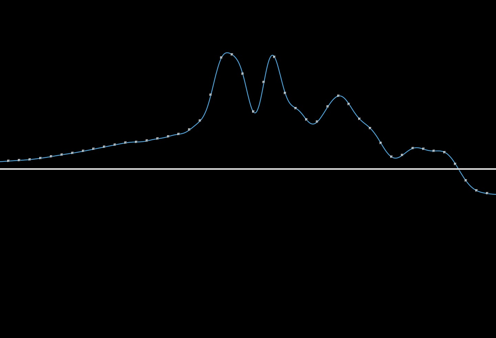
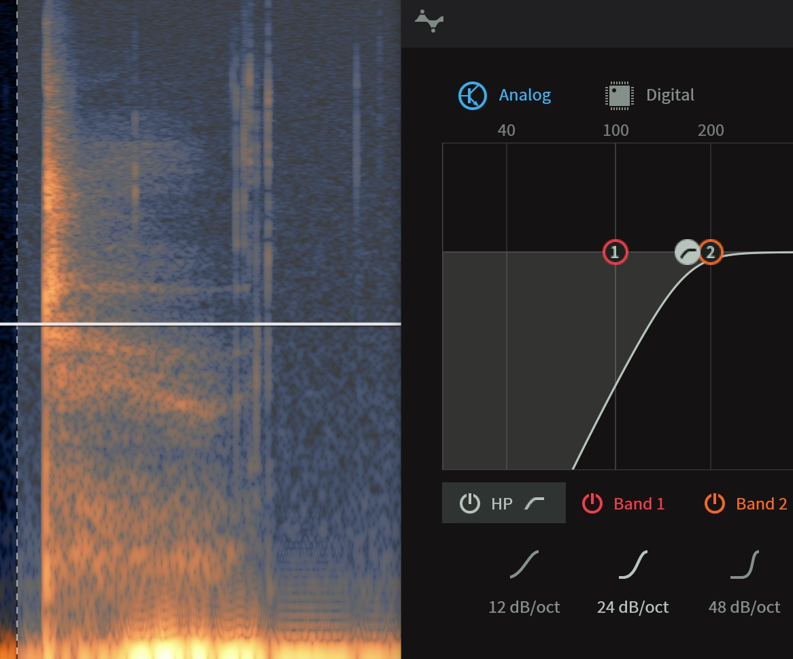

# Logbook

This README.md acts as the logbook for the project.

This github repository is setup to archive my PhD work titled 'Brain Computer Music Interfacing with Meditation'. The website [https://bcmi.khofstadter.info](https://bcmi.khofstadter.info) is an archive of the main outcomes. This README.md file is the more detailed log, that keeps me focused.

The main contributor to this research is [Fredik Olofsson](https://github.com/redFrik). 

---

## todo:

- continue gateway experience with eeg; 
- update JAVA on mojave - test openbci; 
- try wifi with virgin modem and Direct mode;  
- learn frame drum sounds from youtube (find course);
- refine druming with EEG > studio record and screenrecord; 
- get impedence measurment into sc; 
- understand ~energy; 
- make a soundscape for NF (REI)
- print normal box and higher with laser cutting, glue old; 
- get a new battery; 
- connect roland to MOTU; 
- connect Zoom to mac withouth extra soundcard (maybe another adapter?) 
- Brian Eno: https://www.youtube.com/watch?v=cv7epY75Wa0
- how to monitor impedence (ask openbci gui >> this will help stream line work >> no need for openbci_gui? 
- does motu need to run all the time?
- test saving eeg data to file, while recording (send to Clemence)
- write survey for each test group; 
- test with 5 people (3 soundscapes in 1 h session);
	1. two computers - two people? 
- make EDM with knowledged, test with eeg? - portfolio item;
- record more music with frame drum; 
- visualize bmp/cpm of live frame drumming; 

### Soundscapes: 
1. REI (frame drum sounds are triggered and changing with EEG) 
2. Tibetain Bowls ??
3. 3D - something 3d is moving
4. isotropic ??
5. binaural (how to test?, can I copy a protocol of Hemi Sync?)
6. recorded frame drums to listen to > EEG changes ambient sounds; 

NF / soundscapes

* shall we add deep meditation to focus and mindfulness?
* how does Jeff Strong know the accurate BPS?
* check what HemySync used in their training e.g what sounds they add, what BPS/hz they use, how it is shifted;
* do we ask the listener to 'listen' to the music, or shall it be in the background ([like when problem solving](https://www.youtube.com/watch?v=whYGDvNohzo))?
* polymetre vs polyrhythm;
* Sufi music;

Writing

* organise literature folder;
* check where the paper could be submitted;
* organise resources page;
* compare jeff, binaural, isotropic, ...

### frame drum studio recordings
? how to record it properly in studio? ([1](https://www.gearslutz.com/board/so-much-gear-so-little-time/183935-mic-selection-bodhran.html))
?? what is a proximity effect when recording? 
?? how to record this - asked, Gareth, Matt and Mark; 
- maybe record in another place with some interesting reverb: 
	- ? can interesting reverb add to altering the state of mind; 

---

## diary

### 2019 07 22
1. new S3 arrived; 
2. tried to write code for impedance check in sc - help needed; 
3. started: [Beginners guide to the Frame Drum](https://www.youtube.com/watch?v=DuzrQKUyzKQ) by Pete Lockett

### 2019 07 19
1. have been communication with Ivan about the S3 and other NF related issues. 
2. S3 is on the way from China; 
3. managed to make a subclass of DataRecord.sc; 
4. emailed Clemens the raw file to test in Matlab; 
5. replied to Andrej
6. suggesting Goldsmith music&mind Msc to choose 2nd supervisor from; 
7. made a screenrecording with eeg and frame drum, asked Clemens to check it, I am looking for artifacts induced by drumming (movement) and increased theta and gamma; 
8. i have requested Matlab to be on my computer; 

### 2019 07 18
1. experiment with last studio recording's phase; 
2. open_bci gui issues (impedence) 
3. sc - experimenting with sc DataRecord - trying to write a class; 
4. got in touch with hemi-sync about metamusic.  how to make music for them?  checking their store (https://hemi-sync.com/): andrej hrvatin is very interesting: https://hemi-sync.com/product/heros-journey/; https://nimetu.org/shamanic-drumming-the-percussionists-perspective/ - the idea is to make minimal dub techno style that is not pre composed but with their guidence; 
5. andrej hrvatin. breathe in breathe out performs in the dark - sent him an email, he sent a long reply; 

### 2019 07 17
1. 3d printing of raised encloser 
2. studio recording aru frame drum (no pulse, freestyle, AKG414 and SM57, + binaural with Zoom, some iphone video recordings): 
	- not really good music, recordings might be good; 
	- needs to practiec meditation to be able to focus and stay a bit more repetetive, at the moment the music is too random, thoughts are not settled, so this is probably a good representation of a not focused mind; 
	- information on phase issues: https://www.uaudio.com/blog/understanding-audio-phase; https://www.youtube.com/watch?v=rXQcjaXnhG0, https://www.youtube.com/watch?v=JH0ByODyd3o

### 2019 07 16
- testing wifi in openbci-gui, jumps without filters as well: probably a programming issue;
- testing sc fft plot with 'first trip' music, also tested dataRecord and playback, matching screen recording, all good.

### 2019 07 11
- double checking that signal is OK or not in openbci gui, AND it is not OK.  so problem is not in sc code; 
- fine tuned wifi-setup when firmware updates: no need to remove the shield from the cyton; 

### 2019 07 10
- openbci_gui test for github issue; 
- openbci_sc_wifi_still_jumping; 

### 2019 07 09
- rewrote fftplot sound example code, now thresholds seems to work again; 
- learnt some tinkercad to amend some openbci enclosers, hope to print next week; 

### 2019 07 08
learnt: 
- lanscan needs to be restarted when new scanning; 
- serial communication works, when having wifi shield on: 
1. make sure wifi shield has osc firmware and is paired to linksys (no need to take wifi shield off the openbci board, just make sure the external switch is powered off; after pairing Lanscan needs to see it (if it was running before, Lanscan needs restarting); 
2. serial in openbci_gui (check impedence) 
3. serial in supercollider
4. wifi in supercollider 

### 2019 07 05
- wifi shield firmware setup for open_bci_gui, working with linksys modem; 
- signal in open_bci_gui not jumping; 

### 2019 07 04
- soldering antenna, working; 

### 2019 07 03
- in studio recording frame drum with 3 mics; 
- pulse sensor is too loud, started using only light; 

### 2019 07 02

- tested wifi shield jumping signal again, and broke the antenna off; 
- tested impedance measurements in sc: 
? ask openbci forum; 

### 2019 07 01
- added more salt in the water, earlier it was much less; 
- tested more salt, maybe better, not sure; 
- impedence test in sc - not sure how it works; 
? is there a way to continuously monitor impedence and save in a file with eeg data?
- wifi shield tested again - data jumping; 

### 2019 06 28
1. test default Wifi firmware (2.0.5) with OpenBCIGUI (OpenBCI_GUI-v4.1.0-beta.1); 
- test eeg with serial - all good; 
- test eeg with wifi - could not connect; 
2. test custom OSC Wifi firmware with sc; 
- test f's code - in relevant youtube video; 
3. organising faq; 
4. getting in touch with Greentek - no reply; 

### 2019 06 26
buy new EEG cap. 
	- get in touch with people who bought the S3 cap; 
	- get touch on skype with Greentek 
		- is Bennie still there?
		- can they still do the same deal or perhaps cheaper? 
		- why did you go back to not sintered electrodes with this cap?

### 2019 06 26
- IP is mine - confirmed by ARU; 
- IADS sounds enquiry sent to Emily; 

### 2019 06 25
- broken antenna on RDF chip re-soldered, maybe only 3 legs, not lost packages in sc;
? clearing both electrodes, cap? 
? how does low battery effect the signal?  

### 2019 06 24
Testing Jumping signal: 
- little thing that broke off might be the issue, but why would this effect the wifi signal? 
- was the wifi working properly after the AES talk, did I use it after the AES talk? 
- there are little green corrosions in the electrode base (rost?); 
todo: 
- need to check whether wifiOSC was ever working in sc? 
- put OpenBCI's firmware back on wifi (original) to test wifi in OpenBCI GUI; 
- talk to Istvan about healing the cap; 
- buy a new cap; 
- is there a gel cap in the Music Therepy clinic that I could borrow? 

### 2019 06 21
- testing with distilled water, no difference to jumping signal in Wifi; 
- little thing broke off the OpenBCI board (next to RFD chip);   
conlusion: 
- wifi is worse than serial, why? 
- new electrodes better than old ones; 
- is the wifi shield damaged as well?

### 2019 06 20 
- testing wifi/sc with cap: couldn't get good signal in sc in 2 hours;
- meeting with Ian;

### 2019 06 19
Questions for Ian: 
- how many samples do I need? 
- is it a good idea to record two people simultaneously?
- what does he think about the soundscape ideas?
- what does he think about the NeuroMeditation protocols? which one could be used best with which soundscape? 
- demo in September in Hex?
- y cable;
- feeltrace (trackball mouse) vs accelerometer (not on head?)

### 2019 16 17 
- organise thoughts; 
- drive: after phd (dmt); 

#### 2019 06 11-12-13
* aphorisms prep/concert
* no EEG used; 

#### 2019 06 10
- compose two soundscapes with tibetan bowls and the idea of EEG 
- read 'An electro-acoustic implementation of
Tibetan bowls: Acoustics and perception'
- purchased a Kontakt sample pack; 
- http://musicproductionhq.com/tibetan-singing-bowl/

#### 2019 06 05
- whole day in the recital hall, tested mixer, busing of quad speaker setup;
- changed a few things in the SuperCollider code: now with a function the Ndef stops when the loop gets to the end; 

#### 2019 06 05
- brief from David received, I am expected to trigger sound samples throughout the concert. I probably need to make some of these sounds and bounce them as mono wave files. I am also probably live sound engineer. This means I have to touch the computer often and have more responsibilities than expected. Due to this I was suggested to consider ditching the EEG idea for another time. This suggestion is reasonable, however changes the whole method needed. I am still prepared to carry on using SuperCollider so at the moment (with Fredrik's) help I am trying to refine how to use Ndef to trigger and free sound samples. I also would like
- to carry on using 4 speakers;
- feed in the life sound from the mixer and process it;
- perhaps use a nano controller;

#### 2019 06 04
- thinking about having a static composition on a separate player feed in the mixer (SC on the top);
- moving into JITLib with Fredrik's guidance;

#### 2019 06 03
Aphorisms
- based on Eli's [SuperCollider Tutorial: 20. Microphones and SoundIn](https://www.youtube.com/watch?v=3vu4UbS2NMw), a SoundIn Synth draft with delay was made;
	- todo: check Bus/Grouping related tutorial to have control over modules e.g. delay;

#### 2019 05 31
Aphorisms:   
- 3 short voice samples selected and repaired in RX: 	- Mouth De-click:
	- De-click (if anything left to remove);
	- De-ess
	- De-plosive
	- Direct Sample Editing (if needed)

- - EQ to remove low freq artifact (if needed)

-
	- EQ (remove low energy from 45Hz)
	- Light Voice Denoise;

- what's best for recital hall - Gavin emailed;

#### 2019 05 30
- setting up MOTU with designated OS in living room + 4 speakers;
- trying Pan4 with Slider2D;
- use 'Server.default.options.numOutputBusChannels= 4;'

#### 2019 05 29
- tested MOTU 4 channel with SuperCollider (3h);
- new Pulse arrived: probably as loud as the one before;

#### 2019 05 28
- Skype with David (1h);

#### 2019 05 24
- new Pulse is sent;
- working on Exodus (include methodology/plan) in thesis;

### 2019 05 23
Studio recording with Pulse and Frame Drum
- even with two sound proofing foam, the pulse is too loud in the recordings;
- it is ver difficult (for me) to follow the metronome (the pulse) and dive into an improvisation: not good recordings;
- the binaural recordings with the Roland didn't work out as we couldn't connect both sides of the headphones to the sound card;

### 2019 05 10
Rehearsing Aphorisms in Recital Hall:  
- Wireless Router cannot be next to the wall.
- Frame drum might not work here with the style;
- tried REF on ear, seems to work;
- question: what sounds, when?

### 2019 04 14
- testing new wifi firmware (osc);
- testing new code that comes with it;    
// all works;

### 2019 04 01
- testing new code;
- writing business proposal for Andy Wilson Application;

### 2019 03 29
- demonstration at [AES Immersive and Interactive Media Conference](http://www.aes.org/conferences/2019/immersive/), York

### 2019 03 18-28
- testing code from Fredrik (bcmi diary 18-21); mainly comparing fft plots in OpenBCI and SuperCollider;
- brainstorming about the idea of having our own bci kit (that we sell);

### 2019 03 10-11
- tested new code from fredrik ([youtube](https://youtu.be/RCZW0JGjzWI));
- fine tuned order of execution with OpenBCI_GUI ([youtube](https://youtu.be/RTf_jXjlWbM));
- fine tuning designated OS;

### 2019 03 7 (Thu)
- making sample pack;

### 2019 02 26 (Wed)
Experimenting with auto trim/split in Reaper. Fine adjustments to this tool are needed in order to do loads of manual tasks.

- todo: need to find out how to record this instrument (get in touch with Gareth, Matt and Mark);
- discussion [here](https://www.gearslutz.com/board/so-much-gear-so-little-time/183935-mic-selection-bodhran.html);

### 2019 02 26 (Tue)
- Recordings of frame drum in ARU studio.
- Checking 3d printer in the ARU.
- thinking about the accelerometer on board be used instead of FEELTRACE? probably not, there should be an external system for this, as the head movement might make use feel different;

### 2019 02 11-14 (Tue-Thu)
Jeff Strong's Drumming course: pre course and first week done, frame drum ordered, practicing basic patterns;  
rewriting tempoClock in new software;
ideas for listening test (more in email to Fredik subject: quick update)

Read on AI and D R Hofstadter: https://www.theatlantic.com/magazine/archive/2013/11/the-man-who-would-teach-machines-to-think/309529/

### 2019 02 10 (Mon)
Enrolled on Jeff Strong's Drumming Course. Trying to ask them to make it all available.

### 2019 02 07 (Fri)
continue with Jeff Strong videos and notes;
thinking about odd meters and tempo changes (speed up or down) in SC;

### 2019 02 07 (Thu)
research on Jeff Strong and his drumming techniques;   
more on coming blog post 'jeff strong';
testing new sc widgets that look like OpenBCI GUI widgets;

### 2019 02 06 (Wed)
started redesigning the TempoClock part of the seq;

### 2019 02 04 (Mon)
Test new code from Fredrik.

### 2019 02 03 (Sun)
OpenBCI-SuperCollider update test (bcmi diary 11 video:https://youtu.be/hjnweAmfmm0)

### 2019 02 01 (Fri)

- conversations about corrosion on EEG electrodes;
- checking forum and github issues;
- tested impedence with openbci_gui and greentek, i expected a difference between the electrode heads with the black flap and the once which seem to look brand new with the silver part, but after having experimented for a while, they delivered similar results. now.
	- I move the reference electrode back to REF from CZ, and it seemed to reduce the impedance (WHY?);
	- let's try brand new sponges;
	- let's check the water, i've used normal water;

### 2019 01 31 (Thu)
- tested new softAP from Fredrik, doesn’t seem to be usable as there are too many lost packages;
- tested new OpenBCI_GUI for [impedance issue](https://github.com/OpenBCI/OpenBCI_GUI/issues/427), they updated it, now it work.
- there might be a problem with [EEG corrosion](assets/images/2019-01-31-eeg-corrosion.JPG), hence the high impedance I've been measuring;

### 2019 01 30 (Wed)
- firmware [update](assets/images/2019-01-30-openbci-wifi-shield-update.JPG) with FTDI cable, quark update - test;
- issues with distance and connection between shield/router/computer

### 2019 01 28 (Mon)
- fresh Sierra install;
- following Fredik’s Wifi install guide:
- uploading basic firmware in programming mode;
- had slight issue with connecting wifi shield to home wifi/computer wifi (wifi manager) solution might be to get close to the router;
now sc streams data from wifi;

### 2019 01 24-25 (Thu-Fri)
- Fredrik shared info on how to setup the Wifi OSC;
- needs testing;

### 2019 01 27-28 (Thu-Fri)
- installed Mojave next to Safari, same problem;
- the impedance issue with the GUI has been attended, now I need to test it:
- https://github.com/OpenBCI/OpenBCI_GUI/issues/427#issuecomment-457956993.
- no answer for the FTDI question yet.

### 2019 01 21 (Mon)
- get 3v ftdi adapter for uploading;
- asked questions:
	- https://openbci.com/index.php/forum/#/discussion/1960/which-osx-and-ftdi-version-is-best-to-use-with-the-standalone-openbci-gui

	- https://openbci.com/index.php/forum/#/discussion/1961/impedance-measuring-issue-with-openbci-gui-4-0-3-standalone-osx

- reorganised literature folders and BookEnds ref to files;

### 2019 01 10 (Sun)
* changed REF from REF to Cz after talking to William Croft:
http://openbci.com/forum/index.php?p=/discussion/1663/greentek-gelfree-s-eeg-cap#latest
* need to find a way to use ear-clips for REF with y cable;
* experimented with positioning the board and cables next to me on a chair to reduce 50hz noise and reduce impedance: all worked out;
* for the last few weeks I have been pre-soaking the electrode shells and sponges for around 30 mintutes, when I add them to the cap, they are very wet - seems to help;

earlier outcomes on the [project website](https://bcmi.khofstadter.info)
