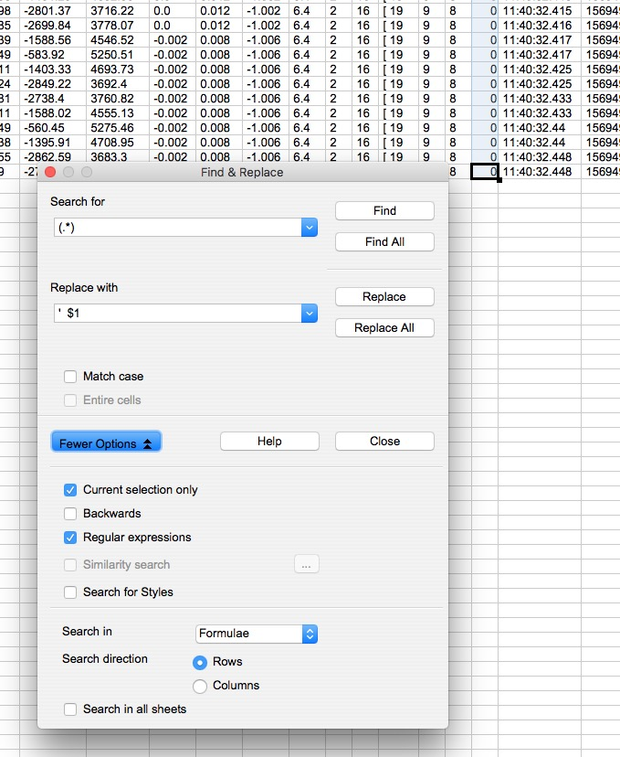

This repository archives my PhD titled 'Developing a Brain Computer Music Interface for Meditation'. It has two main parts:

1. logbook (a detailed diary)
2. [Website](https://bcmi.khofstadter.info) (a Jekyll website with the main outcomes)

---
## now:

1.writing up
- sum notes in last notebook and start new note book;
- need to extend the exploritary LitRev as I was reading general stuff much longer. Perhaps focused could start where NeuroFeedback and Strong was discovered. The Refined is when checking shamanism with EEG, spirits, etc.
- each project, chapter should be illustrated with some drawing - this I could start making in the new notebook, then design in illustrator. Having these drawings will help writing about the projects.

2. bmk
- analyse quantitive data (with plot, video, text)
	- make notes for each session
	- make timeline for all (bmk)
	- find trip in studio (0) - lyncs, and jester
	- find first trip (1) k (jester, one side of the story)
	- sum up each participant;
	- compare participants;
- get some ethics paper done;

3. release
- send BandCamp link to people who did the survey;
- add surround streaming link to BandCamp and other
- waiting for new proof;
- surround: Involve Audio?
- find more places for quad releases;

4. science festival

[ openbci_gui_fftplot_with_neurofeedback-8ch+coherence + bcmi-soundscape-01 ]

- change channel related bits in fft code;
- add NF calculations to bcmi-soundscape code
 1. strong/jovanov: create a window that averages the last x seconds of all channel's theta;
 2. corine1: create a window that averages the last x seconds of mean difference between left and right;
 3. corine2: if correlation window is large enough maybe this can already be used;
 4. corine3: compare power or raw and beta between beginning of session with current part of session (will need some window)
 5. nM QuietM: window for alpha on PZ (do not reward as some papers say gamma increases, so just sonify intelligently)
 6. nM Mindf1: window for FZ an PZ
 7. TM: alpha coherence between front and back, and left and right (sonify)

sonification:

- map Fz theta median to sound > imediate response (very subtle);
- map Pz gamma median to sound > imediate response (very subtle);

- test
	- shamanic meditation survey
	- just frame drumming
	- hemi-sync gateway
	- monolit or hero's journey

5. premier presentation
- edit talk

6. reading
- collura

## logbook

### 2020 03 02
- does mindfulness help with looking at things fromr a different perspectice e.g. putting ourselves in other's shoes?
- meditation related: everyone tells us to 1) concentrate, but not many people tell us how to do it. We need to practice (every day). Practice doing one think at the time --> this will help become better at concentration. Concentrate on something you already have a conversation, job, etc. - and do not introduce something new in your life (e.g. meditation?). 2) develop your will power: a) finish what you begin. b) finish beyond your expectation c) do more than what you think you are able to do. Again, do this with things you already do: bed, breakfast, start finish.

### 2020 02 28-01
- new proof ordered;
- learnt the difference between duplication (CD-R) and replication (normal) - is it worth replicating? 500 min.

### 2020 02 22-26
- new shamanic paper (https://journals.plos.org/plosone/article?id=10.1371/journal.pone.0049360) also indicates lower left brain activity;
- writing commentary: methodology needs help from timeline, timeline helps methodology and will help lit.rev;
- idea of adding wim hof practice to commentary as it should be tested with eeg as well (how long have I been doing it? do I really think it is better then what I do - well, it's different, relaxation, focus is achieved faster, but with the shamanic journeying I get deeper)
- subtracting in the outside word help, for instance trimming the trees in the garden;

### 2020 02 22
- arwork for physical copy adjusted, asked for new proof;

### 2020 02 21
- finished 'playing' quad mix;
- registered to quadraphonic forum;

### 2020 02 20
- bmk analysis;
- waiting for CD example;

### 2020 02 19
- bmk (plotted again, exported level data, merged questionars in one spreedsheet)

### 2020 02 18
- shamanic protocol cap draft incorporates as much as possible from:
	- Jeff Strong (shamanic journey starts with alpha peak, if you are experienced, there is also higher theta activity, theta increases with drumming at 4 bps in shamanic journeying, also increase delta, complexity increases gamma activity, the basetones can also be seen in the raw data)
	- TM: front and back synchronised (high alpha)
	- Jovanov and Maxfiled - total theta band power gradual increas in 20 min;
	- NeuroMeditation: Quiet Mind needs Pz (alpha increase)
	- NeuroMeditation: Mindfulness (1) Thoughtless Awareness (FZ - increase fmTheta; PZ - decrease Gamma)

- finding it frustrating to work with Gimp, so installed Illustrator;
- finished first draft for CD release, sent for test copy;

### 2020 02 14
- finished quad mix of jester;
- need to do quad mix of playing;

### 2020 02 13
- testing new setup, with new sponges and shamanic soundscape l2
- testing fredrik's new examples

### 2020 02 12
- first test with shamanic protocol:  impedance is hard to lower on the side;
- release artwork (based on SHAMAN journal) - considering CD (again);

### 2020 02 11
- Fredrik adds new feature to fft plot example;
- searching shaman papers
- meeting with Ian, discussing plan for new shamanic neuro-feedback;

### 2020 02 10
- finding it difficult to get back into the tasks.  trying music.  maybe only breathing helps.

### 2020 02 07
- 4 channel mix in Reaper, tricky: https://forum.cockos.com/showthread.php?t=231260

### 2020 02 06
Neurophysiological markers ub diverse trance states including yoga and shamanic practices; Zen Buddhist and transcendental meditation; psychedelic experiences as- sociated with hallucinogenic drugs; mediumship/psychography; hypnosis; and shamanic states. These include:
- shift towards right hemisphere
- greater alpha and anterior–posteriorsyn- synchronisation
- increase theta power and and short, synchronous bursts of high-voltage theta waves (4–7 Hz)
- Increased gamma power
- Synchronization of EEG activity between left and right frontal lobes, which may be accompa- nied by progressive frontal hypoactivation in deeper forms of trance

qEEG in the study:
- In the trance state, the subject shows reduced coherence in the right hemisphere and increased coherence in the left hemisphere in the low beta band compared to the controls
- In the high beta band, the pattern is of increased anterior–posterior coherence;
- Of particular interest is the presence of two symmetrical foci of increased power bilaterally in the centro-temporal regions, which is completely absent in the control condition (for this I would need to remove REF from C and use electrodes next to ear. )

### 2020 02 04-05
- papers on meditation, shamanic journeying with EEG;

### 2020 02 03
- 2nd phase coherence added, pushed to repo;
- testing Monolit with breathing exercises and two phase coherence measurements: some ideas, would be good to plot raw EEG as well, but then how do I scroll in, perhaps the idea is to plot only parts of the the whole recording.  make sure you check the volume level before listening, try to have files used on the Desktop, etc. the EEG will need to be checked further in SC or (and) Matlab;
- TM research: it is based on alpha, coherence, etc. (needs to be refines: https://theleadersbrain.org/about.html), https://www.youtube.com/watch?v=DYZM3-09ySE

### 2020 02 02
- last round of personal dissemination

### 2020 01 31
- TM (object referral vs self referral), https://www.youtube.com/watch?v=WgXUxQJcmFw
- local coherence (https://youtu.be/eGijME2caEM?t=268) and global coherence;
- syncing front of the brain (CEO) and back of the brain (world) is good;
- first create local coherence then global
(https://theleadersbrain.org/about.html)
- threshold calculation in bcmi-soundscap plotter not correct, perhaps issue is in soundscape code- check!

### 2020 01 30
- conversation with peter about a possible collaboration;
- open-bci-supercollider/plotter_example.scd plots raw data;
- involvement in xenophobe comment on corona virus, chinese people - applied method, FFR, post then taken down;
- developed the idea for the artwork SM-L2;

### 2020 01 29
- test Monolit with EEG (impedance, start EEG, wim hof breathing, music in VLC, impedance), interrupted, so need to reschedule test.  asked nimetu to provide his own breathing techniques.

### 2020 01 28
- refinement of bcmi-soundscape-01 (plotter and main)

### 2020 01 27
- release: shamanic soundscape - level two; artwork template cannot be run in GIMP, downloading Krita to format file
- plotter in bcmi-soundscape-01 is working, but needs refinements;

### 2020 01 24
- mixing tutorial with Mat. Managed to make fx louder by lowering the vol. of rear channels (3-4). Dum is also tighter due to the wider eq cut. One remaining issue to address now the bass sound is not bassy enough sometimes (~17:20Ö - now addressed with adjusting compression and EG. Listened two two examples, OK. Ready to upload to Bandcamp. Bandcamp upload limit sorted out with purchasing own music. Uploading and naming the album 'shamanic soundscape - l.2' (as this is the missing level) - need work on artwork for digipack

### 2020 01 23
- 8ch coherence code added to repo
- experimenting with bcmi-soundscape-01 plotting (new format, new file needed, it does not seem to plot unfinished soundscapes, ... )
- merged types (test & performance) - started working on flexible code for 2-4ch differences;

### 2020 01 22
- decided to merge nf-test and performance code for repo;
- refined bcmi-soundscape-01

### 2020 01 20-21
- supercollider work on bcmi-soundscape-01 repo

### 2020 01 14-20
- dissemination on FB

### 2020 01 10
- mixing in reaper - two things to look at:
1. tighter bass;
2. louder effects without changing drum sounds (how!?)
- testing fredrik's sound player;
- contacting shaman group admins;

### 2020 01 08
- asked for feedback on hungarian survey, joined two facebook group;
- what are the most difficult parts: analyse EEG data, rewrite thesis, read more EEG, code coherence test for two EEGs

### 2020 01 07
Máté Imre riport (Yotengrit) 2. rész
- rábaközi tudó emberek nem használtak drogokat, értelmetlen szavakat ismételtek, ettől estek transzba.

### 2020 01 06
- due to 'popular demand', the 'shamanic meditation' survey is translated to hungarian, currently being checked;

### 2019 12 17
- mixing in studio: some effect sounds are missing with the 4 to 2 channel VSTs (ReaSurround, ATK decoders), have experimented with binaural as well, conclusion: to achieve a similar mix to Mat's, I need to use the classic render again: frontL + rearL, frontR+rearR;

### 2019 12 15
shamanic journey
- i don't think it is very important to have a question;
- more open way of communicating with our inner wisdom;
- is it important to start visualising the environment at the beginning, while relaxing in the beginning.
- the word 'inspired' - inspiration - you and spirit (you are in the spirit)
- the intelectual part needs to take part but more as vitnes, rather then something in control.
- ? inside/outside inspiration ? can it come from the outside? !!!
- length: short if it is a specific questions, longer for information;
- callback: thanks the spirit;

### 2019 12 13
- sc plotting performance
- realised that forest.scd level (14,16) mistake has effected the soundscape as well - voice for level 2 is missing - is this really a problem?  turn it into an opportunity! it was gone in another universe - haha = again, a unique thing, that helps to stay awake!

### 2019 12 10
- more survey dissemination and personal messages (issue with survey not submitting on Safari);
- will stick to plotting as it is, not looking into other ways, still issues:

- but most look OK:

### 2019 12 06-09
- spotted mistake in 'forest' files, levels numbers were not saved correctly; files in all projects ameneded;
- raw files need to be changed manually in the last level - should be done with fine/replace in BBEdit:

- issues with survey, not submitted (earlier not working on some browsers)

### 2019 12 05
- getting an extension might be more difficult than thought;

### 2019 12 04
- refining plotting in sc;

### 2019 12 03
- plotting date in sc; there is an issue with some of the files and a routine that downscales info. plotting works, but there is an error message;
- raw text file amendments (for now removing '['s is enough) :
	- using BBEdit_12.6.7 (see updated workflow below)
- survey dissemination

### 2019 12 02
- more discemination of survey via emails and new traditional shamanism facebook group;
- looking at Will's Matlab script;

### 2019 11 29
- meeting with Martin and co. (survey feedback) and Alex;
- meetin with Will and Szilvia (Matlab learning)
- mixing with Matt (needs more time, there seem to be differences between software)

### 2019 11 27-28
- more posters in Essex;
- followup email to CFI event bookers (through David C.)

### 2019 11 26
- update on sc forum - phase coherence;
- migrate mix settings from protools to reaper - not good sound;
- dissemination of survey link;

### 2019 11 25
- tunnelblink vpn not working out today;
- communicating with shamanism group admin about issues related to posting/commenting with external link;
- uploading paintings to earn trust of facebook shamanism group;
- difficulties with sending out more messages on FB to people I am not friends with;
- uploading painting to khofstadter.info and linking to shamanism group;
- more dissemination via facebook messages and email (asked Shamanism group admin to allow messaging group members privately);
- testing tunnelblink and sc messaging between uk-germany with fredrik

### 2019 11 22
- meeting with india and invitation to talk in london
- meeting with g and nick (surprise) - discussing shadow and general things;
- poster printed (bit cut off!) - some put out;
- sc: communication between berlin-cambridge via sc tested;

### 2019 11 21
- difficulties with obtaining rights to use the original version of the shaman image;
- Mat sends details for mix (probably need to do together at one point);
- survey final - disseminated via Facebook post (+tags), psy music group,
- survey changes based on FSS feedback.

### 2019 11 20
- checking Mat's mix, asking for plugin setups so I can duplicate for other recordings and experiment further with binaural for this recording;
- survey amendments: making arousal-valance map in Ilustrator (Gimp would be the choice- but can work faster in AI atm).
-

### 2019 11 19
- mix back from Mat, very good, perhaps bass from sc file needs to be more centred;
- phase syncronisation in sc;
- editing in Premier;
- survey amendments (remove file upload as too expensive), add setting conditions, emphasise question making;

### 2019 11 18
- phase syncronisation in sc;
- discussing website submission with doctoral school;

### 2019 11 15-17
- working on shamanic meditation survey: received feedback from shamanic fb group, 2nd supervisor, waiting for Gavin and FSS;

### 2019 11 09-14
- discussing mix of FI performance with Matt Skitmore;

### 2019 11 09-13
- working on shamanic soundscape survey;

### 2019 11 09-12
- added more data to timeline;
-  Will sent some Matlab code for theta plotting;
- marcy, what carrier freq. to use in survery for BB version?
- CD samples ordered for shamanic soundscape physical copy (the idea is to gain interest by telling people that their artwork will go on the CD artwork and the website - free advertisment);

### 2019 11 09-11
- investigating options for vis.js to be used for phd timeline, narrowd workflow done;

### 2019 11 09-10
- investigating alternatives to Premier for video editing. Blender is fast, but could not work out right video format and it takes time to learn (later). iMovie only has two video channels. Screenflow for editing this large multi cam project is too slow.

### 2019 11 07-08
- listening to Cave and Cosmos (good if your eyes are tired)
- mixing three performances in Reaper;
- working on phase coherance code;
- creating interest in drawing after shamanic journeying (facebook group);

### 2019 11 05
- demo at ARU, music students, recorded music;
- 30min setup is tight;

### 2019 11 04
- bennie and ivan asked about new S3 corrosion
- survey issue - how do people attache their images? Can they get an ID after the survey that they can refer to?
- prep for Wed 6 Nov ARU demo (tripods, tech, ..)

### 2019 11 03
- reply from JH on SC forum re phase coherence;

### 2019 10 30
- mixing in Reaper;

### 2019 10 28-29
- organising notes;
- organising assets;

### 2019 10 26
- cambridge festival of ideas (50-60) people, archived, ...

### 2019 10 25
- final coding to use phase sync in performance;
- setup for demo/performance;

### 2019 10 21
- 4 channel at home + 1 live (instead of SM57 Zoom H1 is used);

### 2019 10 19
- feedback on coherance on openbci forum;

### 2019 10 18
- experimenting with code;
- - Ian has introduced some functions in Matlab (some his, some from BioSig);

### w.c. 2019 10 07
- having difficulties with reading raw file in matlab;
- playing back sc raw files with added data is OK in openbci 4.1.3;

### w.c. 2019 10 03

how to amend the raw files? We need to amend the raw files as some softare does not like the extra '[' characters. Also, I was thinking of adding the thresholds (theta, gamma) the the raw file, however these values were only changed ones at the beginning and remained the same throughout - so no real need to keep them in the files. Later, once there is an automatic thresholding code, these threshold values should be recorded in the raw file as well.

- amending raw eeg text files in OpenOffice (if addition is needed)
	1. drag & drop raw eeg text file on an emtpy spreed sheet in open office with the following settings:

	2. add column where needed
	3. fill in column info (watch video)
	4. remove [ and ]
	5. add ` '` where needed with find & replace ([help](https://forum.openoffice.org/en/forum/viewtopic.php?t=26830))

	

	6. don't save as other format, save as current format.
	7. make sure header is exaclty the same as before (remove extra commas)
	7. check with eye some rows.
	8. check back in sc...

- if we only need to remove:
	- amending files in Atom is very slow:

	- amending files in BBEdit (TextWrangler) is superfast;

- final:

### 2019 09 30
b03
- check how laud they hear it with a decibel meter; 

### 2019 09 27
b02
- have something to do while swiching off, setting up electrodes (maybe a movie on shamanism), when drawing play the music back perhaps it helps to remember?

m01
- apart from loud noise comming from downstairs, all good.
- hair much longer (more difficult) - maybe helped increase impedance;

### 2019 09 24
b01 test:
- restless, eyes not closed, moving, reading, I should not write with a loud pen, make sure you are calm, welcoming, relaxed, not watching screen helps (was turned away), transformation of the room to something more relaxed, smoke much earlier;
- as b was not focusing, we had a talk, next time b will try harder to relax and not move.
- what do i tell them? that i believe in it?

### 2019 09 18
- need more EEG data to analyse;
- should myBCMI be more interactive instead of simply responsive?

### w.c. 2019 09 09
- meeting with PR:
	- university of bristol - interdisciplinary people;
	- nominating ex. sup. - call Brigitta;
- working on timer/reward/soundscape in sc;

### w.c. 2019 09 02
- help for reaper file [organising](https://forum.cockos.com/showthread.php?p=2178859)
- have been working on the sequencer mainly in sc;

### w.c. 2019 08 26
- consulted sc forum for paradiddle code and started working on it;
- asked mathematics.stackoverflow for guidence on mathematics used (nor answer)

### 2019 08 25
Two drumming books read on archive.org. Can we make a sc function out of these?

### 2019 08 24
- revising Simon Holland paper about polyrhythm (need to find another reference to this)

### 2019 08 23
b (pretest not b01)
- no questionaire, i kinda know what he is like, he touched the eeg while tests, he couldn't concertrate on the drumming (maybe needs to be made more explicit, maybe 30 min of the most minimal shamanic drumming is to much if they are not interested in this, he asked about the smudge scent, he was told it will be max 1h with some sounds, i don't think he was focusing on the music, do people actually want to change something in them (differentiate between people who like the idea and and the ones who don't seem to be interested), after 15 minutes he was told to focus on the breething and the music (as he was not focusing on anything really, he was looking at the fft plot often, he is clever, wanted to understand (maybe we need to make sure people understand the agenda >> you will understand if you let go of understanding, there were small noises from the outside, after the test he said he was not tired when we started (altough was jawning constantly), he said he only got tired towards the very end, he said he could differentiate between the wide and the narrow sound (probably different timbre)
-

### 2019 08 18, 19
- battery connectors too big for OpenBCI
- adding generator, panning, ...
- refining of sequencer;
- washed old cap;
...

### 2019 08 16
- core shamanism vs traditional shamanism
- the brain uses information from reality to construct your world

### 2019 08 14
- shamanic journey: white willow man (jester: jokerface/flat face), highway, house on the left (this was in the studio)
- Ian Walker on practice research and how it is archived (ARRO, figshare), Simon Smith emailed with question on this topic;

### 2019 08 13
- tests with other fft plots and energy variables
- testing pausing openbci fft;
...

### 2019 08 09
- new cap: 8 channel, sequencer with drumming, slowed down by plotting;
- new cap: yanxi - catnap (hair is a problem, time series was too low, but then fft window was fine: interesting)
- new greentek cap tested quickly with supercollider and live frame drumming;

### 2019 08 05
- new tempoClock and varieties Function started;
- shamanic journey with drumming in study (Zoom recorded): Zsolti and his mum on the top of the hill

### 2019 08 02
- impedance in sc fixed with fredrik, new repo, downloaded (having impedance measuring in sc has streamlined work as now we don't need to open the openbci gui to start with);

### 2019 08 01
- installed Matlab and EEG Lab, currently looking at [this](https://openbci.com/community/eeglab-tutorial-import-data/) and waiting to see Clemens for help;

### 2019 07 31
- further impedence checks in sc >> getting somewhere;

### 2019 07 30
- wrote to Roland about adapter for soundcard use;

### 2019 07 30 studio work
- roland mic needs adapters (with phantom - XLR) - writing to Roland for help;
- recording with new technique (2 AKG 414, 2 SM58)

### 2019 07 29
- testing OpenBCI_GUI_v4.1.3.app > works;
- readings:
	- bcmi-diary-hemi-sync-advanced-focus-10
	- bcmi-diary-impedance-code-sc

### 2019 07 25
- readings:
	- bcmi-diary-hemi-sync-advanced-focus-10
	- bcmi-diary-impedance-code-sc

### 2019 07 22
1. new S3 arrived;
2. tried to write code for impedance check in sc - help needed;
3. started: [Beginners guide to the Frame Drum](https://www.youtube.com/watch?v=DuzrQKUyzKQ) by Pete Lockett

### 2019 07 19
1. have been communication with Ivan about the S3 and other NF related issues.
2. S3 is on the way from China;
3. managed to make a subclass of DataRecord.sc;
4. emailed Clemens the raw file to test in Matlab;
5. replied to Andrej
6. suggesting Goldsmith music&mind Msc to choose 2nd supervisor from;
7. made a screenrecording with eeg and frame drum, asked Clemens to check it, I am looking for artifacts induced by drumming (movement) and increased theta and gamma;
8. i have requested Matlab to be on my computer;

### 2019 07 18
1. experiment with last studio recording's phase;
2. open_bci gui issues (impedence)
3. sc - experimenting with sc DataRecord - trying to write a class;
4. got in touch with hemi-sync about metamusic.  how to make music for them?  checking their store (https://hemi-sync.com/): andrej hrvatin is very interesting: https://hemi-sync.com/product/heros-journey/; https://nimetu.org/shamanic-drumming-the-percussionists-perspective/ - the idea is to make minimal dub techno style that is not pre composed but with their guidence;
5. andrej hrvatin. breathe in breathe out performs in the dark - sent him an email, he sent a long reply;

### 2019 07 17
1. 3d printing of raised encloser
2. studio recording aru frame drum (no pulse, freestyle, AKG414 and SM57, + binaural with Zoom, some iphone video recordings):
	- not really good music, recordings might be good;
	- needs to practiec meditation to be able to focus and stay a bit more repetetive, at the moment the music is too random, thoughts are not settled, so this is probably a good representation of a not focused mind;
	- information on phase issues: https://www.uaudio.com/blog/understanding-audio-phase; https://www.youtube.com/watch?v=rXQcjaXnhG0, https://www.youtube.com/watch?v=JH0ByODyd3o

### 2019 07 16
- testing wifi in openbci-gui, jumps without filters as well: probably a programming issue;
- testing sc fft plot with 'first trip' music, also tested dataRecord and playback, matching screen recording, all good.

### 2019 07 11
- double checking that signal is OK or not in openbci gui, AND it is not OK.  so problem is not in sc code;
- fine tuned wifi-setup when firmware updates: no need to remove the shield from the cyton;

### 2019 07 10
- openbci_gui test for github issue;
- openbci_sc_wifi_still_jumping;

### 2019 07 09
- rewrote fftplot sound example code, now thresholds seems to work again;
- learnt some tinkercad to amend some openbci enclosers, hope to print next week;

### 2019 07 08
learnt:
- lanscan needs to be restarted when new scanning;
- serial communication works, when having wifi shield on:
1. make sure wifi shield has osc firmware and is paired to linksys (no need to take wifi shield off the openbci board, just make sure the external switch is powered off; after pairing Lanscan needs to see it (if it was running before, Lanscan needs restarting);
2. serial in openbci_gui (check impedence)
3. serial in supercollider
4. wifi in supercollider

### 2019 07 05
- wifi shield firmware setup for open_bci_gui, working with linksys modem;
- signal in open_bci_gui not jumping;

### 2019 07 04
- soldering antenna, working;

### 2019 07 03
- in studio recording frame drum with 3 mics;
- pulse sensor is too loud, started using only light;

### 2019 07 02

- tested wifi shield jumping signal again, and broke the antenna off;
- tested impedance measurements in sc:
? ask openbci forum;

### 2019 07 01
- added more salt in the water, earlier it was much less;
- tested more salt, maybe better, not sure;
- impedence test in sc - not sure how it works;
? is there a way to continuously monitor impedence and save in a file with eeg data?
- wifi shield tested again - data jumping;

### 2019 06 28
1. test default Wifi firmware (2.0.5) with OpenBCIGUI (OpenBCI_GUI-v4.1.0-beta.1);
- test eeg with serial - all good;
- test eeg with wifi - could not connect;
2. test custom OSC Wifi firmware with sc;
- test f's code - in relevant youtube video;
3. organising faq;
4. getting in touch with Greentek - no reply;

### 2019 06 26
buy new EEG cap.
	- get in touch with people who bought the S3 cap;
	- get touch on skype with Greentek
		- is Bennie still there?
		- can they still do the same deal or perhaps cheaper?
		- why did you go back to not sintered electrodes with this cap?

### 2019 06 26
- IP is mine - confirmed by ARU;
- IADS sounds enquiry sent to Emily;

### 2019 06 25
- broken antenna on RDF chip re-soldered, maybe only 3 legs, not lost packages in sc;
? clearing both electrodes, cap?
? how does low battery effect the signal?

### 2019 06 24
Testing Jumping signal:
- little thing that broke off might be the issue, but why would this effect the wifi signal?
- was the wifi working properly after the AES talk, did I use it after the AES talk?
- there are little green corrosions in the electrode base (rost?);
todo:
- need to check whether wifiOSC was ever working in sc?
- put OpenBCI's firmware back on wifi (original) to test wifi in OpenBCI GUI;
- talk to Istvan about healing the cap;
- buy a new cap;
- is there a gel cap in the Music Therepy clinic that I could borrow?

### 2019 06 21
- testing with distilled water, no difference to jumping signal in Wifi;
- little thing broke off the OpenBCI board (next to RFD chip);
conlusion:
- wifi is worse than serial, why?
- new electrodes better than old ones;
- is the wifi shield damaged as well?

### 2019 06 20
- testing wifi/sc with cap: couldn't get good signal in sc in 2 hours;
- meeting with Ian;

### 2019 06 19
Questions for Ian:
- how many samples do I need?
- is it a good idea to record two people simultaneously?
- what does he think about the soundscape ideas?
- what does he think about the NeuroMeditation protocols? which one could be used best with which soundscape?
- demo in September in Hex?
- y cable;
- feeltrace (trackball mouse) vs accelerometer (not on head?)

### 2019 16 17
- organise thoughts;
- drive: after phd (dmt);

#### 2019 06 11-13
* aphorisms prep/concert
* no EEG used;

#### 2019 06 10
- compose two soundscapes with tibetan bowls and the idea of EEG
- read 'An electro-acoustic implementation of
Tibetan bowls: Acoustics and perception'
- purchased a Kontakt sample pack;
- http://musicproductionhq.com/tibetan-singing-bowl/

#### 2019 06 05
- whole day in the recital hall, tested mixer, busing of quad speaker setup;
- changed a few things in the SuperCollider code: now with a function the Ndef stops when the loop gets to the end;

#### 2019 06 05
- brief from David received, I am expected to trigger sound samples throughout the concert. I probably need to make some of these sounds and bounce them as mono wave files. I am also probably live sound engineer. This means I have to touch the computer often and have more responsibilities than expected. Due to this I was suggested to consider ditching the EEG idea for another time. This suggestion is reasonable, however changes the whole method needed. I am still prepared to carry on using SuperCollider so at the moment (with Fredrik's) help I am trying to refine how to use Ndef to trigger and free sound samples. I also would like
- to carry on using 4 speakers;
- feed in the life sound from the mixer and process it;
- perhaps use a nano controller;

#### 2019 06 04
- thinking about having a static composition on a separate player feed in the mixer (SC on the top);
- moving into JITLib with Fredrik's guidance;

#### 2019 06 03
Aphorisms
- based on Eli's [SuperCollider Tutorial: 20. Microphones and SoundIn](https://www.youtube.com/watch?v=3vu4UbS2NMw), a SoundIn Synth draft with delay was made;
	- todo: check Bus/Grouping related tutorial to have control over modules e.g. delay;

#### 2019 05 31
Aphorisms:
- 3 short voice samples selected and repaired in RX: 	- Mouth De-click:
	- De-click (if anything left to remove);
	- De-ess
	- De-plosive
	- Direct Sample Editing (if needed)

- - EQ to remove low freq artifact (if needed)

-
	- EQ (remove low energy from 45Hz)
	- Light Voice Denoise;

- what's best for recital hall - Gavin emailed;

#### 2019 05 30
- setting up MOTU with designated OS in living room + 4 speakers;
- trying Pan4 with Slider2D;
- use 'Server.default.options.numOutputBusChannels= 4;'

#### 2019 05 29
- tested MOTU 4 channel with SuperCollider (3h);
- new Pulse arrived: probably as loud as the one before;

#### 2019 05 28
- Skype with David (1h);

#### 2019 05 24
- new Pulse is sent;
- working on Exodus (include methodology/plan) in thesis;

### 2019 05 23
Studio recording with Pulse and Frame Drum
- even with two sound proofing foam, the pulse is too loud in the recordings;
- it is ver difficult (for me) to follow the metronome (the pulse) and dive into an improvisation: not good recordings;
- the binaural recordings with the Roland didn't work out as we couldn't connect both sides of the headphones to the sound card;

### 2019 05 10
Rehearsing Aphorisms in Recital Hall:
- Wireless Router cannot be next to the wall.
- Frame drum might not work here with the style;
- tried REF on ear, seems to work;
- question: what sounds, when?

### 2019 04 14
- testing new wifi firmware (osc);
- testing new code that comes with it;
// all works;

### 2019 04 01
- testing new code;
- writing business proposal for Andy Wilson Application;

### 2019 03 29
- demonstration at [AES Immersive and Interactive Media Conference](http://www.aes.org/conferences/2019/immersive/), York

### 2019 03 18-28
- testing code from Fredrik (bcmi diary 18-21); mainly comparing fft plots in OpenBCI and SuperCollider;
- brainstorming about the idea of having our own bci kit (that we sell);

### 2019 03 10-11
- tested new code from fredrik ([youtube](https://youtu.be/RCZW0JGjzWI));
- fine tuned order of execution with OpenBCI_GUI ([youtube](https://youtu.be/RTf_jXjlWbM));
- fine tuning designated OS;

### 2019 03 7
- making sample pack;

### 2019 02 26
Experimenting with auto trim/split in Reaper. Fine adjustments to this tool are needed in order to do loads of manual tasks.
- todo: need to find out how to record this instrument (get in touch with Gareth, Matt and Mark);
- discussion [here](https://www.gearslutz.com/board/so-much-gear-so-little-time/183935-mic-selection-bodhran.html);

### 2019 02 26
- Recordings of frame drum in ARU studio.
- Checking 3d printer in the ARU.
- thinking about the accelerometer on board be used instead of FEELTRACE? probably not, there should be an external system for this, as the head movement might make use feel different;

### 2019 02 21
- REI: 2nd jouney: fell asleep;

### 2019 02 20
- REI: first shamanic journey (i forgot about this one): animals, castenada's portal, ...

### 2019 02 11-14
Jeff Strong's Drumming course: pre course and first week done, frame drum ordered, practicing basic patterns;
rewriting tempoClock in new software;
ideas for listening test (more in email to Fredik subject: quick update)

Read on AI and D R Hofstadter: https://www.theatlantic.com/magazine/archive/2013/11/the-man-who-would-teach-machines-to-think/309529/

### 2019 02 10
Enrolled on Jeff Strong's Drumming Course. Trying to ask them to make it all available.

### 2019 02 07
continue with Jeff Strong videos and notes;
thinking about odd meters and tempo changes (speed up or down) in SC;

### 2019 02 07
research on Jeff Strong and his drumming techniques;
more on coming blog post 'jeff strong';
testing new sc widgets that look like OpenBCI GUI widgets;

### 2019 02 06
started redesigning the TempoClock part of the seq;

### 2019 02 04
Test new code from Fredrik.

### 2019 02 03
OpenBCI-SuperCollider update test (bcmi diary 11 video:https://youtu.be/hjnweAmfmm0)

### 2019 02 01

- conversations about corrosion on EEG electrodes;
- checking forum and github issues;
- tested impedence with openbci_gui and greentek, i expected a difference between the electrode heads with the black flap and the once which seem to look brand new with the silver part, but after having experimented for a while, they delivered similar results. now.
	- I move the reference electrode back to REF from CZ, and it seemed to reduce the impedance (WHY?);
	- let's try brand new sponges;
	- let's check the water, i've used normal water;

### 2019 01 31
- tested new softAP from Fredrik, doesn’t seem to be usable as there are too many lost packages;
- tested new OpenBCI_GUI for [impedance issue](https://github.com/OpenBCI/OpenBCI_GUI/issues/427), they updated it, now it work.
- there might be a problem with [EEG corrosion](assets/images/2019-01-31-eeg-corrosion.JPG), hence the high impedance I've been measuring;

### 2019 01 30
- firmware [update](assets/images/2019-01-30-openbci-wifi-shield-update.JPG) with FTDI cable, quark update - test;
- issues with distance and connection between shield/router/computer

### 2019 01 28
- fresh Sierra install;
- following Fredik’s Wifi install guide:
- uploading basic firmware in programming mode;
- had slight issue with connecting wifi shield to home wifi/computer wifi (wifi manager) solution might be to get close to the router;
now sc streams data from wifi;

### 2019 01 24-25
- Fredrik shared info on how to setup the Wifi OSC;
- needs testing;

### 2019 01 27-28
- installed Mojave next to Safari, same problem;
- the impedance issue with the GUI has been attended, now I need to test it:
- https://github.com/OpenBCI/OpenBCI_GUI/issues/427#issuecomment-457956993.
- no answer for the FTDI question yet.

### 2019 01 21
- get 3v ftdi er for uploading;
- asked questions:
	- https://openbci.com/index.php/forum/#/discussion/1960/which-osx-and-ftdi-version-is-best-to-use-with-the-standalone-openbci-gui
	- https://openbci.com/index.php/forum/#/discussion/1961/impedance-measuring-issue-with-openbci-gui-4-0-3-standalone-osx

- reorganised literature folders and BookEnds ref to files;

### 2019 01 10
* changed REF from REF to Cz after talking to William Croft:
http://openbci.com/forum/index.php?p=/discussion/1663/greentek-gelfree-s-eeg-cap#latest
* need to find a way to use ear-clips for REF with y cable;
* experimented with positioning the board and cables next to me on a chair to reduce 50hz noise and reduce impedance: all worked out;
* for the last few weeks I have been pre-soaking the electrode shells and sponges for around 30 mintutes, when I add them to the cap, they are very wet - seems to help;4
earlier outcomes on the [project website](https://bcmi.khofstadter.info)

### 2018 11 28
ASMR tests

### 2018 11 5
experimenting with remembering names by listening to a monotone internal rhythm

### 2018 10 31
working on AES Immersive and Interactive Audio paper

### 2018 03 07
concentrative vs mindulness meditation: does/can one become the other?  is it then stepping inwards outwards?

### 2018 02 20

### 2017 02 06
**Horowitz, The Universal Sense**
- loud sounds: biologically hard-wired: large predetors;
- worms eating carcass sound might be percieved as beautiful if it's not seen;
- silence can increase awareness (due to fear perhaps as well? )
{{ to add }}
- loudness (emphasis), low pitch (implication of size and dominance), faster tempo (urgency)
- brain plasticity: dissonant sounds or atonal music can sound harmonics once exposed to it for long enough (perhaps involves learning as well)

### 2017 02 05
**Anna Wise, Awakening The Mind**

> there are many complex and valid varieties of B/A/T/D combinations that represent a state of awakening. p8

- delta: unconsious, intuition, insight;
- theta: deep, subconsious understangind and awareness;
- alpha: wraps the lucidity of imagery around the content so that it can be experiences;
- beta: adds conceptual interpretations, explanations and words;

suggestions for music test:
- music to be gentle, non invasive, non melodic, non familiar, no tunes, there shoudl be a balance between real environment and music (software) sounds (why?)
- sitting or laying, provide glass of water, eyes open first, than closed, warm room
- after the meditation: write doens words, symbols, colours, sensations, ...
- breathing with own rhythm, don't follow a group, relax your tonge, relax your breathing
- what do listen to: choose one (!) 1) sounds from the outside (environment), 2) sounds from the room (inside environment), 2) your body 3) your internal space 4) your thoughts - don't label them (~~ to deep listening ~~ reduced listening)

### 2017 02 04
**Stong, Different Drummer**
- brain wave entrainment, auditory driving.
- simple rhythms vs complex rhythms (the faster the more variation the brain needs, to keep the brain engages, vary the rhythm)
- difference to BBFs
- when to use odd meters?
- examples: 7.4bps: deep, centred calm; 8.6: focused calm
- would it be good to add some other natural sounds?
- why are there ambient sounds in the REI program:

### 2017 02 03
- listening to music emotionally or intellectually?
- Oliveros, reduced listening, etc. Schaefer, acousmatice listening (not looking for the cause),  ...
- listening (active) vs hearing (passive);

- active listening vs passive hearing :
> Random sonic events keep the brain looking for patterns, whereas easliy indentifiable musical forms are quickly identified, and attention becomes habituated. ~Leeds, p 197?

**Deep listening**
Oliveros:

Focal Listening  |  Inclusive Listening
--|--
  focused, concentrated, linear, exlusive, moment to moment attention to details | open, global, inclusive, "all that can be heard in an ever expanding field of continious simultanious events perceived as a whole"

> - balancing these two may bring hemeostasis. ~ Oliveros

> Deep Listening is listening in every possible way to everything possible. This means one hears all sounds, no matter what one is doing. ~ Oliveros in Acoustic and virtual space as a dynamic element in music, p45.

> listening is forgetting the name of the thing one hears ~Chion p460?

> [when making music] learn to appreciate more than what your own species has attuned itself to hear. ... Make more then human music.  ~Rothernberg, p56 and p68

> the real voyage of discovery consists not in seeking new landscapes but in having new eyes (Marcel Proust)

> we want to listen more closely, but are rarely ottered (allowed) the opportunity by ourselves/others?

> The challange in sustaining global attention is to remain open to all sounds, to resist th habitual filters, while remailnig explosed to a huge and confusing array of possibilities.  p227

> Focul and global listening (attention) work together in expansion and contraction, bu the two are seldom experienced simultaniously. Seldom?? p227?

Global listening involves including, rather than exluding sounds.

DL produces alpha waves, which helps creativity and opens the bridge between the conscious and the subconscious mind. Relaxed, yet alert. Norman Lowry, p293

> DL stimulates imagination, opens and heightens awareness, connects with the subconcsious and questions pre-conceptions and assumptions. p295

- can lerning how to be mindful with deep listening help hearing ourselves? then, understand the self's deeper structures?

Benefits of DL, we recognise the importance of quiet. Quiet Places. Skills developed to be selectice when bomboarded with sensory information. Hmm.. what about the shamanic journey? The ability to control attention.

### 2017 02 02
- extasy vs trance?
- Judith Becker, 2004, Deep Listeners (near religious transcendental experiments, Oliveros

Joshua Leeds, The Power of SoundIn
1. Physics of sound

### 2017 02 01
Sound Healing Jonathan Goldman:
1. everything is vibration;
- hearing range is narrow.  if we cannot hear something (or measure something), that does not mean it does not exist.
- everything has a resonant frequency: 1) free resonance (e.g tuning forks sharing the smae frequency), 2) forced resonance (vibrating, entraining, they may not share the same frequency)(http://www.creationsmagazine.com/articles/C174/Goldman.html)
- human organs may have a specific frequency;
- organs together create a personal resonance;
- natural/healthy vibrations are restored when sound healing: removing crystalised minerals from the kidney, viruses distroyed with sound?
- sound healing has two methods: 1) hear the body 2) destroy the invader
- which one is the easiest to control: breathing, hearth, brainwaves - does it matter?   they seem to be all related :)

2. Intent
- how do I define this in scientific terms (attention?)

3. We are all different
> any time of music/sound depending on the time, place and needs of the individual cab be healing.

Important

1. the belief of the person receiving the healing in the healer;
2. the belief of the healer believing int he medicine;
3. the relationship?

other ideas:

- schumman resonance
- low frequency elecromagnetic brainwaves
- silence
- singning
- chakras (Valerie Hunt, Infinite Mind)
  - each has a vowel
- resonant frequency therapy (cymatheroapy, dr Peter Guy Manners, Royal Rife - visur killer)
- sonic entrainment tech
  - rober monroe (hemisync)
  - kelly howell, joshua leeds, jeffrey thompson, anna wise, tom kenyon
- binaural beats in traditional instruments
  - tibetain bowls
  - peruvian whistling vessel
- aural enhancment technology
  - electronic ear (Alfred Tomatis' filtered music - how is this related to brain.fm?
  - voice analysis therapy (Sharpy Edwards) reintroduce the missing frequncies in the voice, reintroducing them into hearing is healing.
  - bioacoustics;
  - soundwave energy
  - biowaves
  - vibroacoustic therapy (table, beds, somatron, betar, genesis machine (Michael Breadford), dr jeffrey thompson )
  - tunging for therapy (dr john beauliem)
  - sound pucture (bio soinc / acutonics?)
  - natural acoustic instruments (crystal bowls, tibetan bowls (not from tibet, peruvian whistling vesel, digeridoes, = they provide simplicity, anyone can do!))

### 2017 01 15
- have been listening to a lot of Alan Watts lectures and he started talking to me: when I have a question the answers often come with his voice;

### 2018 01 12
- habit changes haven't kicked in yet;

### 2017 01

music
- no societies withough music (Ball, 2010)
- seems to involve all of the brain (Ball, 2010)
- major - minor (indicator of valance is musical key, Juslin, 2005, p173)
- tempo is a prime indicator of arousal (fast -high A, slow, low A)
- key progressions? simple >> complex (jazz?)
- musical composition (from tonic to tonic (Alan Watts Hide and Seek))
- sonification vs musification (sonification ex: music to debug programm,Vickers and Alty 2003, p173)
- frequncy following response (BPM to HZ (bps): 60 BPM = 1 hz (1 bps))

### 2017 01 04

Why is it important that the user can make his/her own music?
1. flow feeling can be strong when making music
2. we are all different (user have different backgroundss, they should be able to choose their own temrs/musical)

{{ image }}

### 2017 01 03
> the freedom of making mistakes
- keep the rhythm, don't stop when you make a mistake (drumming)

### 2017 01 02
- generative music vs non generaive music (is it more live?  does it help immersion?)
- does user experience need to be smooth?

### 2017 01 01
Notes for 'Mindfullness Reinvented' (M-Tracker, Smith J.C. 2016)
- CEN - Central Executive Network + Left frontal cortex (attention direction, decision making, working memory, regulatory thoughts)
- DMN - Default Mode Networking (mind wandering  mode, not focused)
- SN salience network
- mindulness is a progressive skill

REF:
- Kasamatsu, 1966 (alha waves)
- Cahn and Polich, 2006 (brainwave sync)
- gamma waves
- Smith, 2016 (activity of the brain as a whole, instead of localised acticity)

### 2016 03
- research project objectives might chnge?: how and why?  new interest in deeper stuff than relaxation...

### 2016 03
preparing for young street presentation:

- algorithmic/random (always changing). the buddhist idea of destroying/erasing the artwork.  to keep in mind that it's temporary.
- how does 'playing' with the boundaries/limits/opposites help understanding.  what is 'understanding'

### 2016 02
- how to connect Blofeld synth to EEG
- ! "maybe there is no challenge to complet onl a timescale within to make music that can earn nf points - this would be passive BCI"

### 2016 01 29
- how could i sonify/musify the water around the islets?  also, perhaps the top of the islet (the land) has another sound as the bottom (the one underneat the water) - why is this important?

### 2016 01 08
- how to visually represent the islets?

### 2016 01 01
- how do i move sound in a 3d space that can be used to imagine 'something' moving around the human body, fast?

### 2015 10 09

#### Guide to Brain-Computer Music Interfacing

**Brain–Computer Music Interfacing: Interdisciplinary Research at the Crossroads of Music, Science and BiomedicalEngineering**
(Eduardo Reck Miranda)
- 3 challenges of BCMI
  1. extracting meaningful control information from EEG
	2. design of effective generative music techniques
	3. improve people's lives
- soft BCI vs hard BCI:
  - soft: the music system reacts to the mental system
  - hard: voluntary control of music (inc. learning and ability):
  	- consious effort (1) e.g. congnitive task (imagining moving of limbs)
  	- operant conditioning (2)
- types of analysis: FFT, Hjörth
- moving forward:
  1. discovering meaningful musical information
  2. powerful musical systems which engage researcher

**Electroencephalogram-based Brain–Computer Interface: An Introduction**
(Ramaswamy Palaniappan)

- EED data acquisition -> noise reduction -> feature extraction -> classification -> device commands (spec. for applications)
- types of BCI (to add)

**Contemporary Approaches to Music BCI Using P300 Event Related Potentials** (Mick Grierson and Chris Kiefer)
- P300, ERP vs NFT (accuracy?)
Väljamäe et al: - the mapping strategy depends on the application, mapping does not mirror strict semiotic relations (meanin making)

**Prospective View on Sound Synthesis BCI Control in Light of Two Paradigms of Cognitive Neuroscience** (Mitsuko Aramaki et al.)
- ambigious sounds have a slover reaction time in the ERP and the are more negative
- different ERP for metal, glass and wood sounds
- BCI uses: 1) unhealthy (rehabilitation, reducing disability, impove quality of life physically disabled), 2) healthy (increase the realism of games (REF)
- types: 1) explicit (do we have to learn new ways of thinking to control BCI or do we have to find out how to see our thoughts in the EEG, maybe both?  is this in line with brain plasticity); 2) implicit BCI (does not require learning period - hypothetical)
- ! "any kind of feedback cannot be used, but only those with the desired effect on the brain and the cognitive activity..." p.81

**Machine Learning to Identify Neural Correlates of Music and Emotions** (Ian Daly et al.)
- learning the regulatory of patterns;
- types of analysis: amplitude (ERP, peak latency, zero crossing), freq. domain (bandpower-FFT, power spectral density (PSD), phase (syncronisation, complex networks), combinatorial (hybrid of all)

 **Emotional Responses During Music Listening** (Konstantinos Trochidis and Emmanuel Bigand)

1. discrete/categorical model, universal emotions (GEMS: genova emotions music scale)
2. dimensional model
3. ...

The role of musical structures on emotions: Effect of mode and tempo (major/minor/fast/slow) - difference in frontal lobe

**A Tutorial on EEG Signal-processing Techniques for Mental-state Recognition in Brain–Computer Interfaces** (Fabien Lotte)

- check this again;

**On Mapping EEG Information into Music** (Joel Eaton and Eduardo Reck Miranda)
- BCMI will benefit music therapy;
- Miranda's categorisation for s:

1. user oriented systems (goal is to understand the meaning of user input e.g. R. Teitelbaum 'In Tune')
2. computer oriented systems (NF, the user has to learn how to perform e.g 'Music for Sleeping and Waking... ')
3. mutually oriented systems (1. the system learns EEG behaviour, ... check again.

- methods for music generation with EEG:
1. EEG sonification (transformation of EEG information into sound for non musical, predominantly medicinal purposes - sound is relative to itself, hearing numerical or graphical data)
2. EEG musification (mapping EEG to organised musical parameters - loose forms of control)
3. BCI control (real time cognitive control of music is achievable)

**Creative Music Neurotechnology with Symphony of Minds Listening** (Eduardo Reck Miranda, Dan Lloyd, Zoran Josipovic and Duncan Williams)
- hypothesis: If we understnd how music affects the mind, we can compose better music.
- everyone's brain is different, therefore it's difficult to have a common ground.
- is the mind seperate from the brian?
- does every brain constract music differently?

**Passive Brain–Computer Interfaces** (George and Anatole Lécuyer)
- passive (user doesn't try to control) vs active BCI (deliberate change)

...
