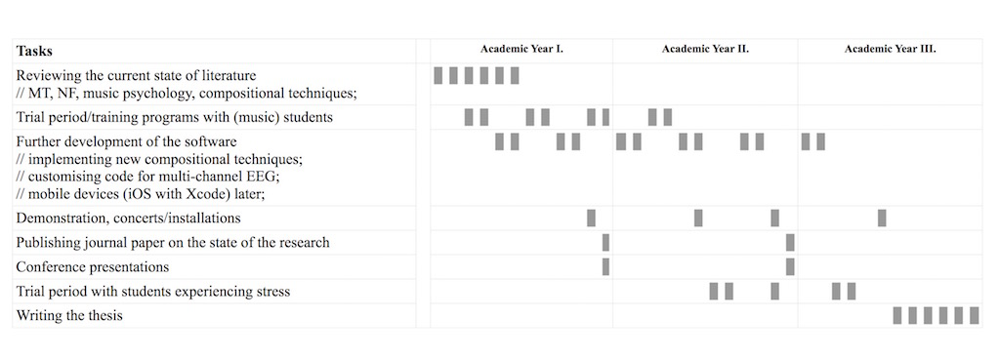

 
In September 2015, I started my PhD in the Anglia Ruskin University with the initial title: Developing Neuro-feedback Music (NFM) Software For Academic Stress Management and Well-being
  
>This research develops software that reinforces healthy brainwave patterns by giving auditory
feedback for better control of central nervous system activity. It will impact people's life by employing the therapeutic benefits of neuro-feedback (NF) and music therapy (MT) for treating academic stress, for example students' anxiety during examination periods. Its effectiveness will be investigated in training programmes and demonstrated in concerts using brainwaves to generate computer-aided compositions with traditional instruments. The impact is of national significance as over 105 million days are lost to stress each year, costing UK employers £1.24 billion according to the Health and Safety Executive. Full proposal [here](../assets/doc/k_hofstadter_phd_2015_09_research_proposal_v07.pdf).

  

