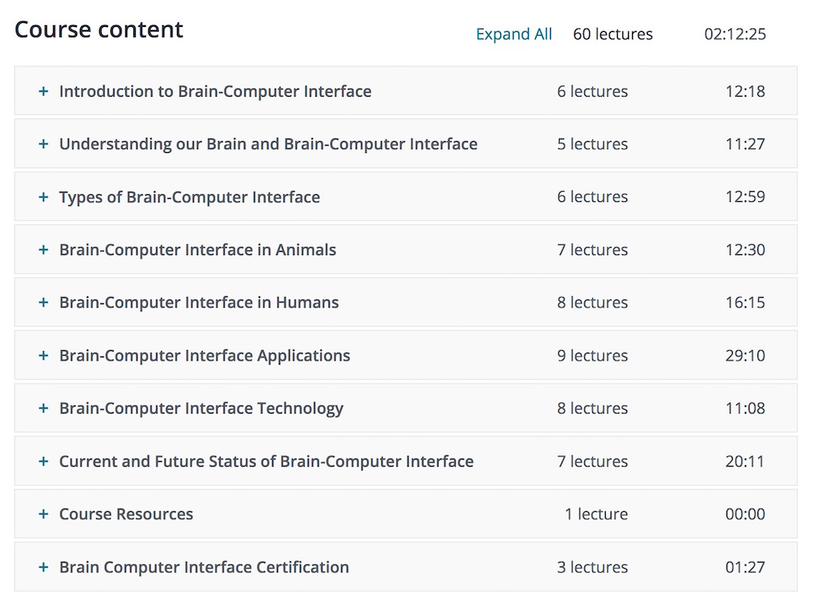

 
I completed the Brain Computer Interface course at [Udemy](https://www.udemy.com/brain-computer-interface/). It was OK, I probably could give it 3 stars. If you do not know anything about BCI, then it is a good introduction. 
  

