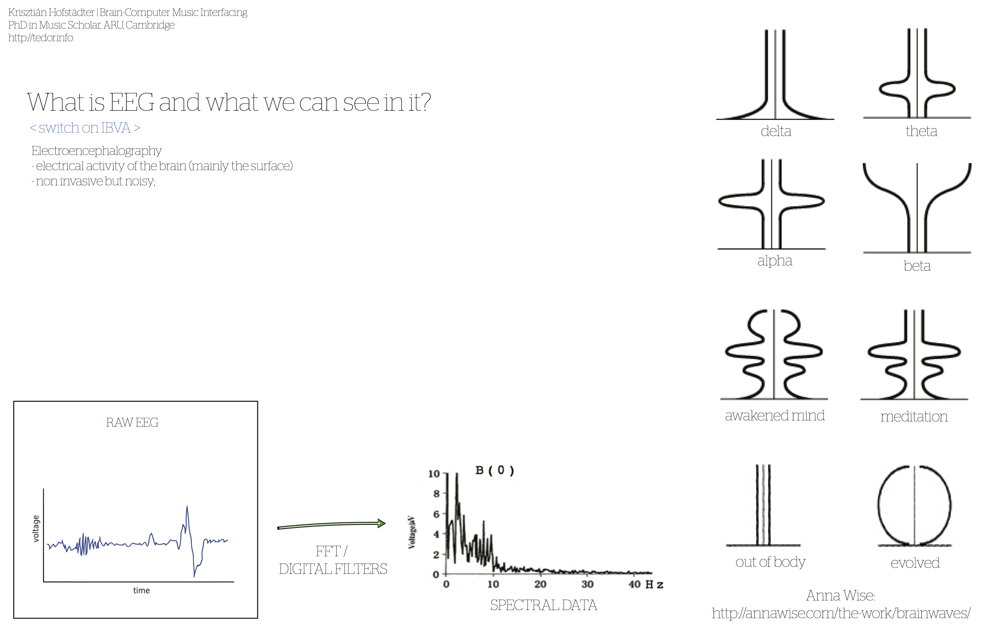

 
General introduction to brain computer interfacing and demonstration of own research to a classroom of Sonic Art students.
 
 

 
 
All slides [here](../assets/doc/k_hofstadter_phd_2016_03_demonstration.pdf).
