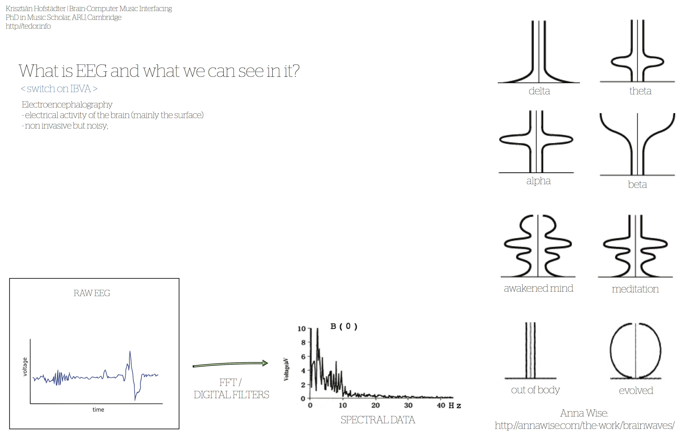

 
Talk introducing BCI in general to sonic art (CMT/ARU) students with some examples from my work.
 
 
One slide:
 
 

 
 
All slides [here](../assets/doc/k_hofstadter_phd_2016_03_demonstration.pdf).
