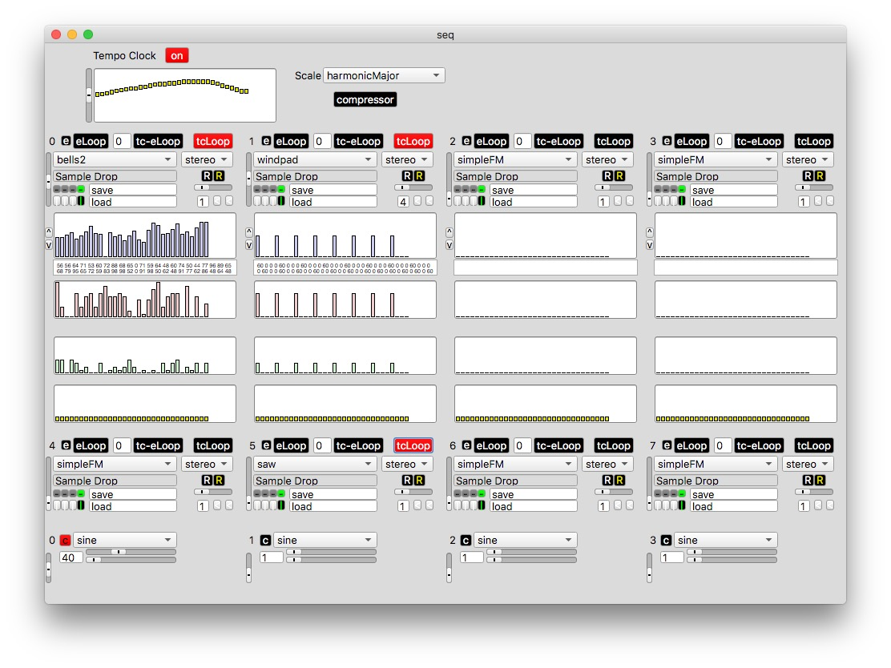

I made a standalone application of the sequencer in BCMI-1 with [Platypus](https://sveinbjorn.org/platypus). The application is simply a merge of the SuperCollider software and my sequencer code. 
 
 
Download latest (2018) version from [here.](https://github.com/krisztian-hofstadter-tedor/NeuroSky-SuperCollider/tree/master/standalones/2016/)
 
 

  
