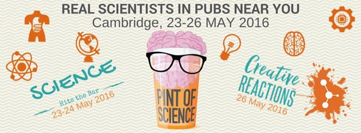
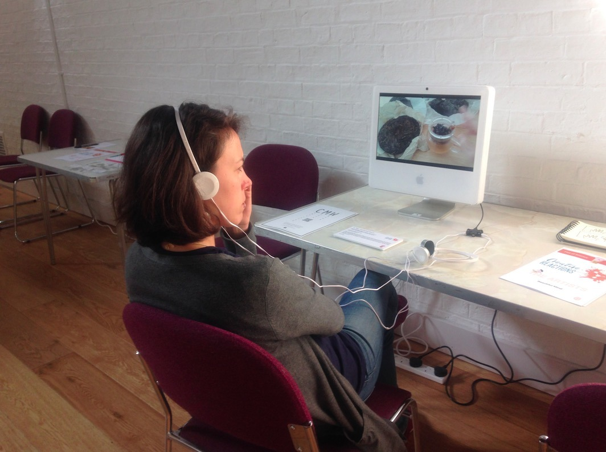
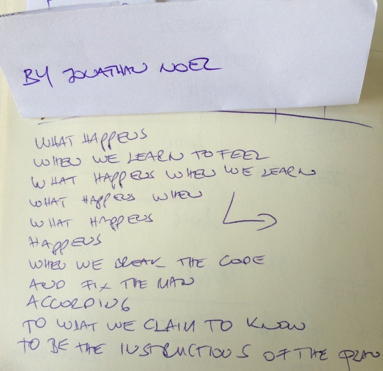
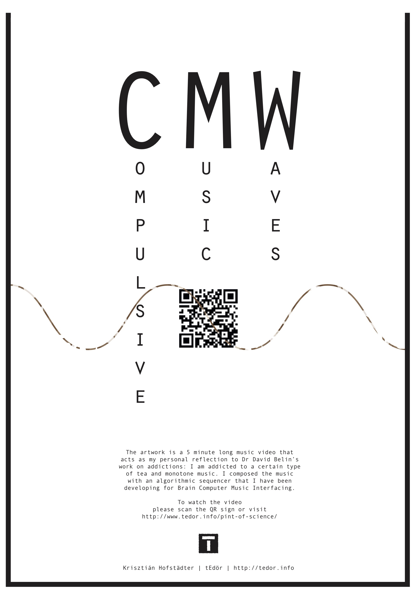

The exhibited audio-music piece titled 'compulsive music waves' is my reflection on [Dr David Belin](http://www.neuroscience.cam.ac.uk/directory/profile.php?davidbelin)’s work on addictions.

> Sometimes I feel addicted to drinking a certain type of tea and making a certain type of music: PuErh tea and electronic music.

  

The video below records a morning tea ceremony with a mobile phone attached to my forehead. After the video recording, the music was composed with the flextime sequencer developed for [BCMI-1](/neurosky-supercollider-interface-and-audio-neurogame/).

<iframe src="https://www.youtube.com/embed/fTeJymxZoJs?rel=0&amp;showinfo=0" style="border: 0; top: 0; left: 0; width: 100%; height: 100%; position: absolute;" allowfullscreen scrolling="no"></iframe>

More info on Pint of Science, Cambridge [here](https://pintofscience.co.uk/event/hacking-the-brain-smart-drugs-and-addiction). Screen-recording of the composition process can be seen below.

credits: Jonathan Noel (poem), Chen Xi (drawing), [Kelcy Davenport](http://www.kelcydavenport.com/) (photo below)

  

  

  

  

<iframe src="https://www.youtube.com/embed/82js1ncB4AM?rel=0&amp;showinfo=0" style="border: 0; top: 0; left: 0; width: 100%; height: 100%; position: absolute;" allowfullscreen scrolling="no"></iframe>

tools: SuperCollider, Logic, iPhone 5S, Adobe Premier
