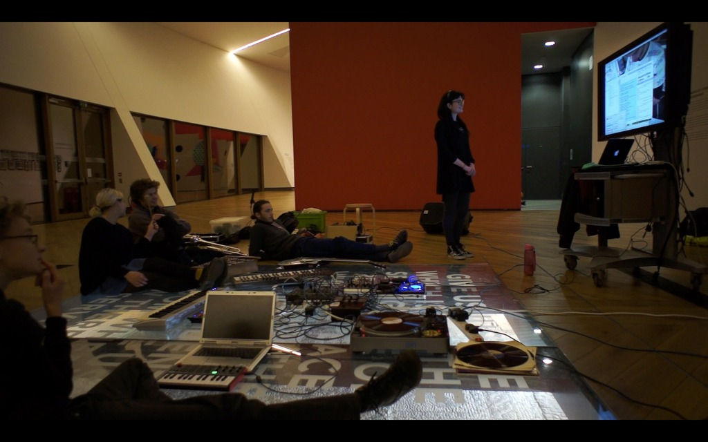
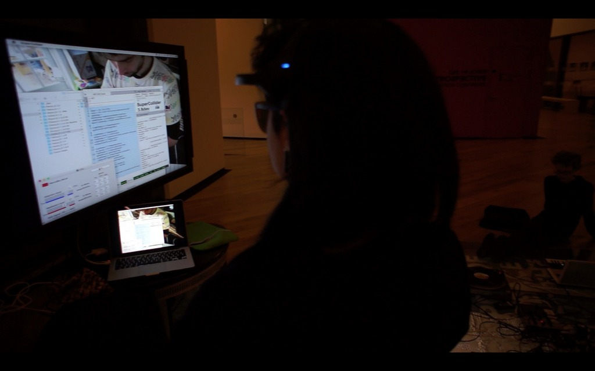
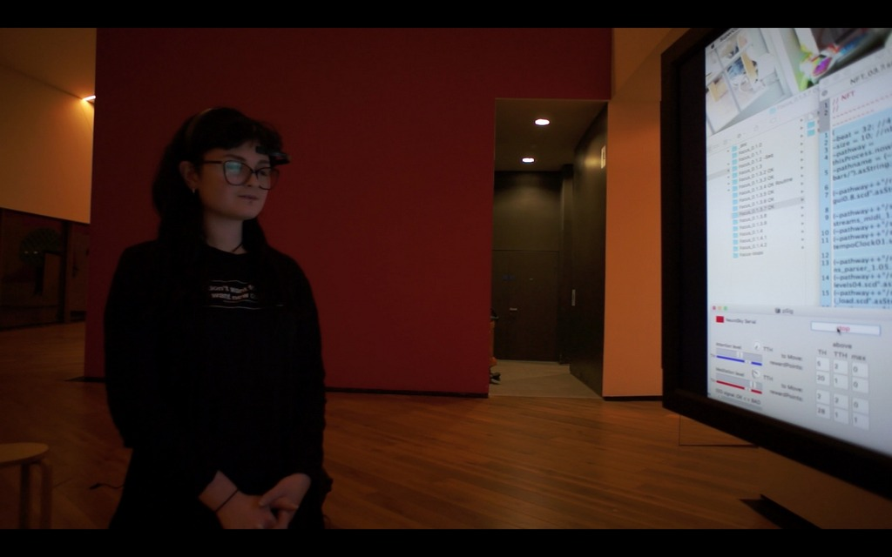
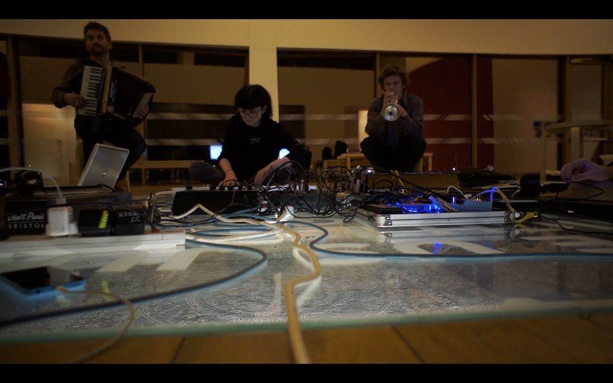
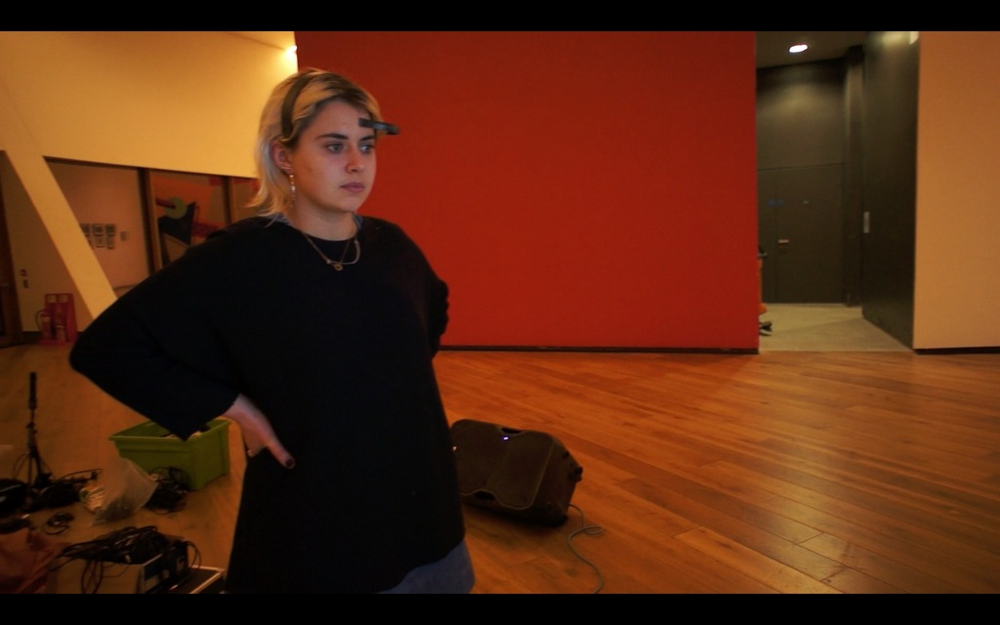
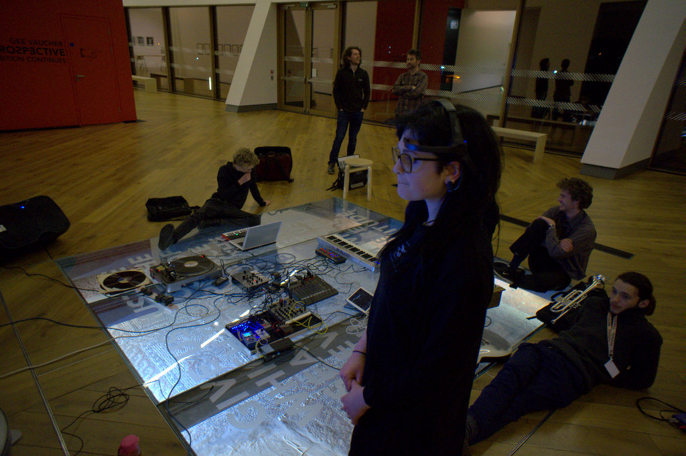
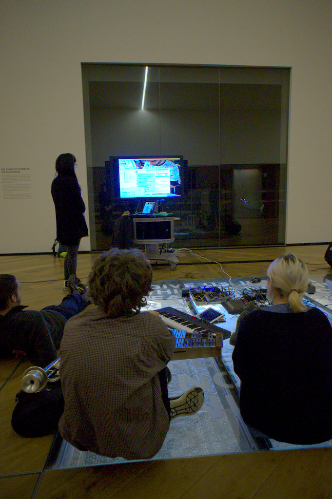

 
I demonstrated the [_focus-neurogame_](https://github.com/krisztian-hofstadter-tedor/focus-neurogame-neurosky-supercollider) as a part of a [Clip Sound](http://www.clipsoundandmusic.uk/) event at [Firstsite](https://firstsite.uk/), Colchester. Members of the group tested and gave feedback on the interface as well as improvised a performance with one of the soundscapes in the interface.
  

  

  

  

  

  

  

  
