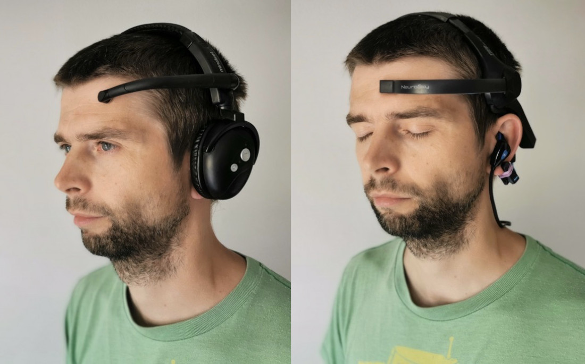

 
code: [GitHub](https://github.com/krisztian-hofstadter-tedor/NeuroSky-SuperCollider)
 
 
 
This project developed a software that interfaces [<kbd>NeuroSky</kbd>](http://neurosky.com/) EEG headbands with [SuperCollider](https://supercollider.github.io/) in the context of an audio neurogame. The goal of the project was to create a neurofeedback tool where the audio feedback (rewards) are embedded in an immersive sonic environment which can help facilitate the desired mental shift.
 
 

 
 
 

 
 
