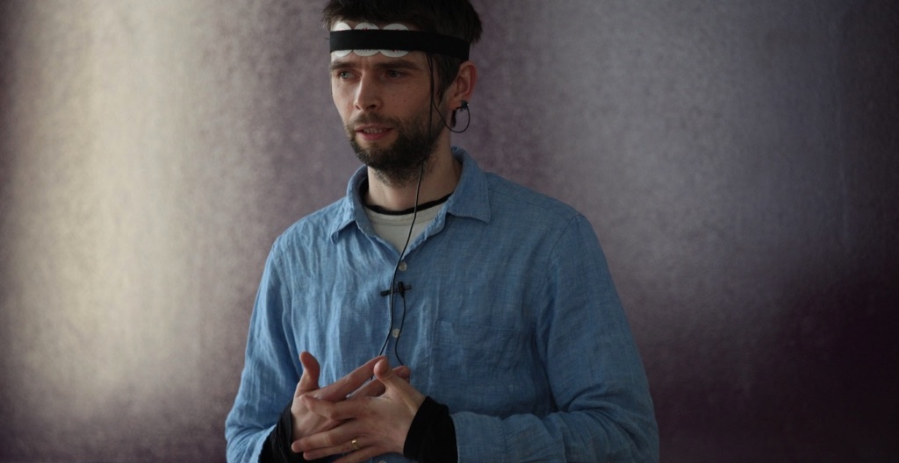
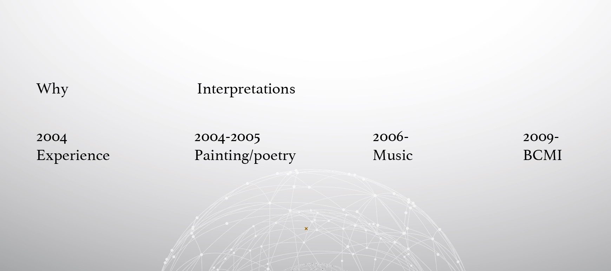
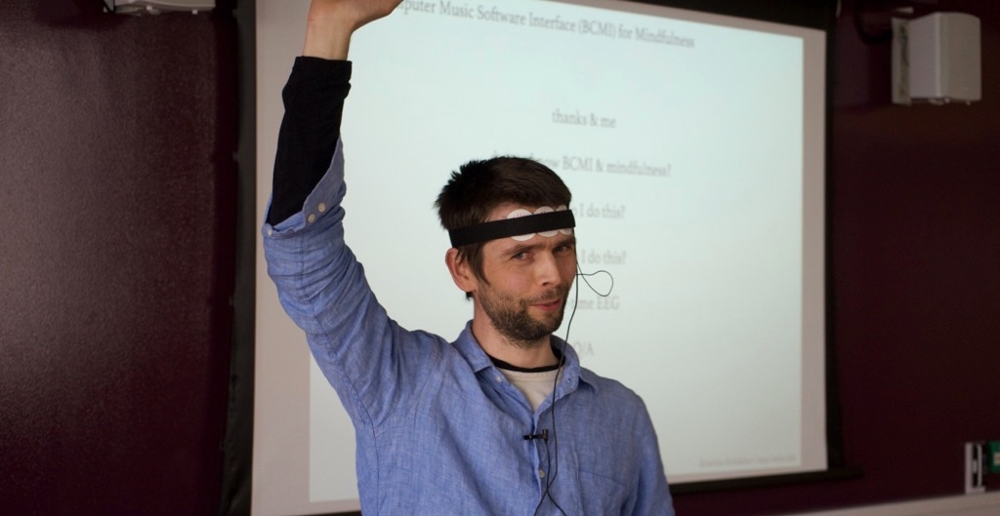

 
Presentation at the 'interpret' StoryLab symposium at ARU.
 
 

 
 
One slide:
 
 

 
 
All slides [here](../assets/doc/k_hofstadter_phd_2018_03_presentation.pdf).
 
 
Full [programme](../assets/doc/k_hofstadter_phd_2018_03_symposium_programme.pdf).
 
 

 

Visual interpretation of my presentation by [Dr Joo Hong Low](https://www.facebook.com/jhlowpicturebook) (left) and [Dr Sarah Gibson Yates](https://www.sarahgibsonyates.net/) (right).
 
 
