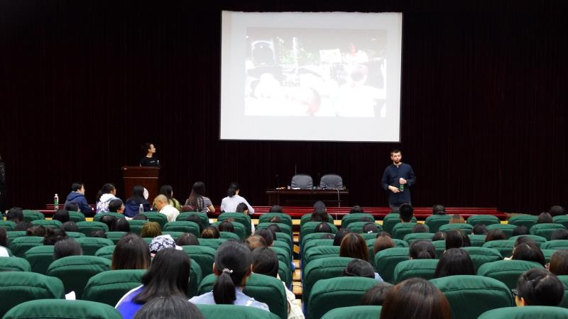

 
Presentation on being a creative technologist, highlighting the BCMI project. China, Yunnan.
 
 

 
 
One slide:
 
 

 
 
All slides [here](../assets/doc/k_hofstadter_phd_2018_04_presentation.pdf).
 
 

 
 
<iframe width="100%" height="166" scrolling="no" frameborder="no" allow="autoplay" src="https://w.soundcloud.com/player/?url=https%3A//api.soundcloud.com/tracks/531671043&color=%23262525&auto_play=false&hide_related=false&show_comments=true&show_user=true&show_reposts=false&show_teaser=true"></iframe>
