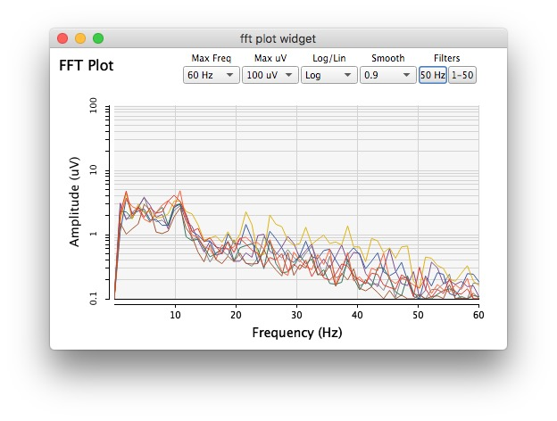

 
code: [Github](https://github.com/krisztian-hofstadter-tedor/OpenBCI-SuperCollider)
 
### SuperCollider classes to communicate with OpenBCI boards
 
This collaboration between [Fredik Olofsson](https://www.fredrikolofsson.com/) (main author) and myself (second author and tester) developed an open source brain-computer interface software that acquires raw data from [OpenBCI](https://openbci.com/) boards via the Serial port. Classes can extract EEG features as well as record and plot data in a variety of forms.
 
 
Time Series features:

  
FFT (band power) features:
 

 
 
FFT plot with adjustable neurofeedback settings:
 

 
 
FFT plot neurofeedback settings and coherence plotting:
 

 
 
 
### Vlog playlist
Tests of major updates are documented in a video blog:
  

<iframe src="https://www.youtube.com/embed/videoseries?list=PLRr9g36OjY681MfQrZcCA3SUxxWJFwkXC" style="border: 0; top: 0; left: 0; width: 100%; height: 100%; position: absolute;" allowfullscreen scrolling="no"></iframe>

 
 
 
### Related Links
Relevant OpenBCI Forum discussions [here](https://openbci.com/forum/index.php?p=/profile/discussions/khofstadter).
