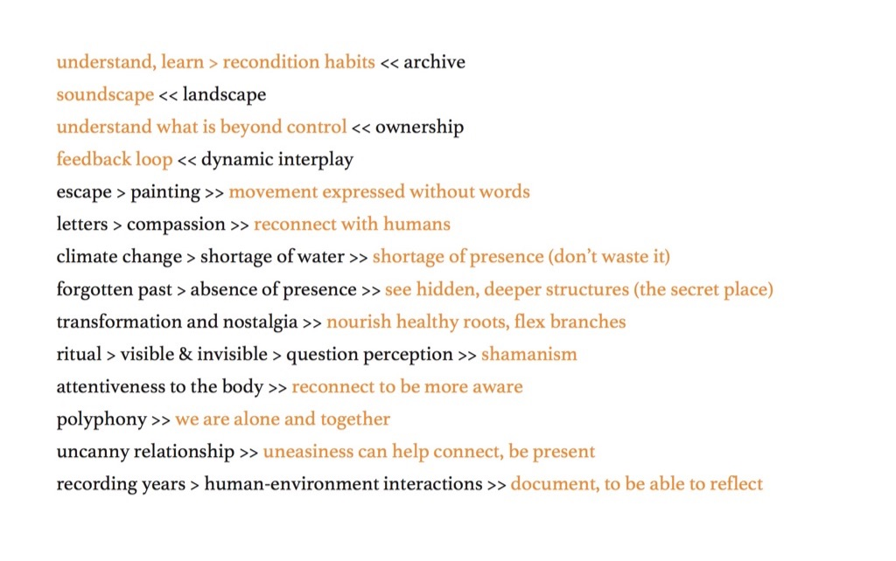

Gave a presentation at [Kelcy Davenport](http://www.kelcydavenport.com/)'s ‘[The Archive and the Contested Landscape](https://thearchiveandthecontestedlandscape.wordpress.com/)' symposium, which was part of the 2018 [Festival of Ideas](https://www.festivalofideas.cam.ac.uk/), Cambridge. My presentation focused on making connections between the key ideas of the symposium and my BCMI research.
 
 

  
One slide:
 

 

Audio archive:
 
<audio controls>
  <source src="../assets/audio/2018-10-24-festival-of-ideas-2018-talk.mp3" type="audio/mpeg">
Your browser does not support the audio element.
</audio>
 
 
All slides [here](../assets/doc/k_hofstadter_php_2018_10_presentation.pdf).
