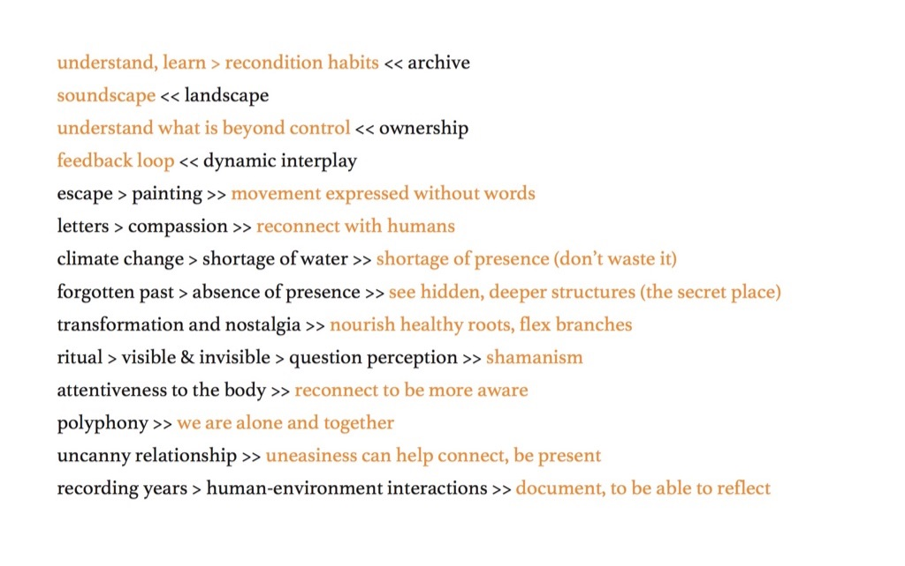

 
Gave a presentation at [Kelcy Davenport](http://www.kelcydavenport.com/)'s ‘[The Archive and the Contested Landscape](https://thearchiveandthecontestedlandscape.wordpress.com/)' symposium, which was part of the 2018 [Festival of Ideas](https://www.festivalofideas.cam.ac.uk/), Cambridge. The presentation focused on the relationship between the key ideas behind the event and my BCMI reseach. 
 
 
One slide:
 
 

 
 
All slides [here](../assets/doc/k_hofstadter_php_2018_10_presentation.pdf).
