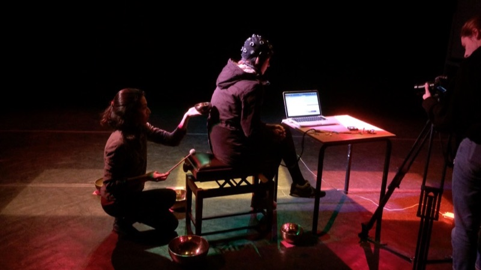
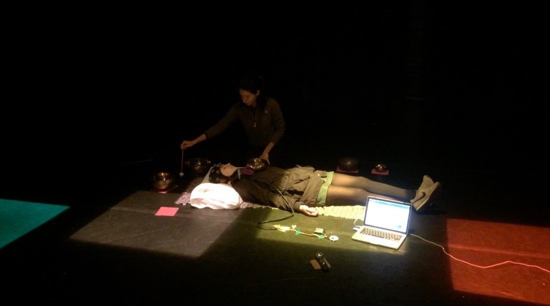

 
I used the [OpenBCI](https://openbci.com/) with a gelfree [Greentek](http://www.greenteksensor.com/) cap to record EEG at F1, F2, T5 and T6 at a sound healing session. In the session [Farah Mulla](http://farahmulla.wixsite.com/farah-mulla-) used her Tibetan singing bowls for around an hour next to and on a participant. The measurements are of interest to my BCMI research as later I plan to test how [extremely low frequencies](https://bestsingingbowls.com/singing-bowl-frequency/) (ELF) can help shift awareness.
  
The participant after the session said that she fell asleep, which for me was interesting as I didn't see an indication of this in the EEG. After around 15 minutes into the session until the end high beta and gamma were the strongest bandwidths. Further analysis of the OpenBCI dataset will be done with another software, later.
 
 

 
 

