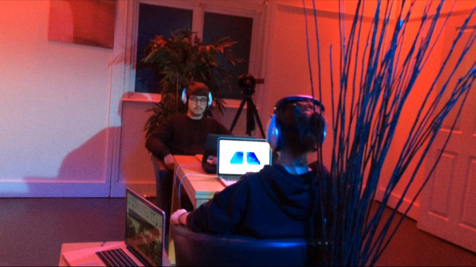
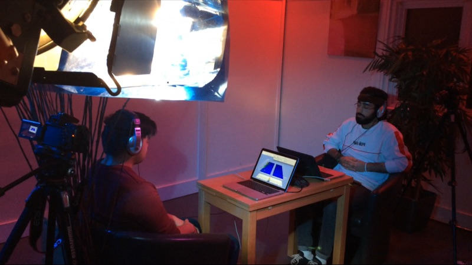

 
I used two [IBVA](http://ibva.co.uk/) hardware to record EEG of six participants in an ASMR study. We had three sessions, in each two people. The sessions had three main stages: normal, ASMR and active listening:
  
5 min normal - eyes open
5 min normal - eyes closed
12 min ASMR - eyes closed
5 min active listening - eyes open
5 min active listening - eyes closed
  

  
_Objectives:_
1) Can we see effects of the ASMR soundtrack in the EEG?
2) Can these effects be sustained in the active listening part?
  
_First analysis:_
By simply revisiting the data in the 3D waterfall visualization of the FFT I can reveal that:
1) participants' left hemispheres were more active, especially in the normal stage;
2) in the ASMR part, the overall activity of the EEGs were reduced compared to the first, normal stages;
3) this reduced activity continued to be in the EEGs in the active listening stage;
4) there were no significant signs in the EEGs that I could (at the moment) consider to be effects of the ASMR;
 
 
The study is part of a documentary about ASMR and hasn't been conducted with strict scientific guidelines. It has helped me to align and compare ideas behind how ASMR is thought to shift awareness with the ideas on how sound connected to meditation can help shift awareness in my BCMI research.
  

 
 
Video recordings of the study were featured in this short film:
 
<iframe src="https://player.vimeo.com/video/308468113?color=c672ff&byline=0&portrait=0" width="640" height="360" frameborder="0" allow="autoplay; fullscreen" allowfullscreen></iframe>

<a href="https://vimeo.com/308468113">TERTIARY SOUND (ASMR DOCUMENTARY)</a> from <a href="https://vimeo.com/solomia">Solomia Dzhu</a> on <a href="https://vimeo.com">Vimeo</a>.

