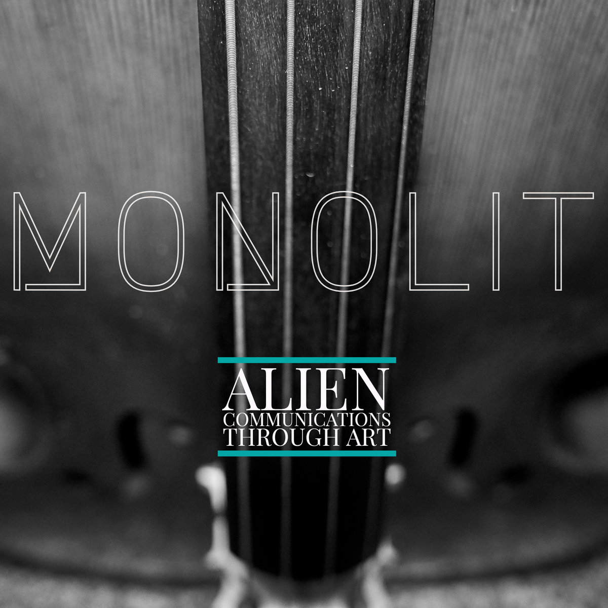
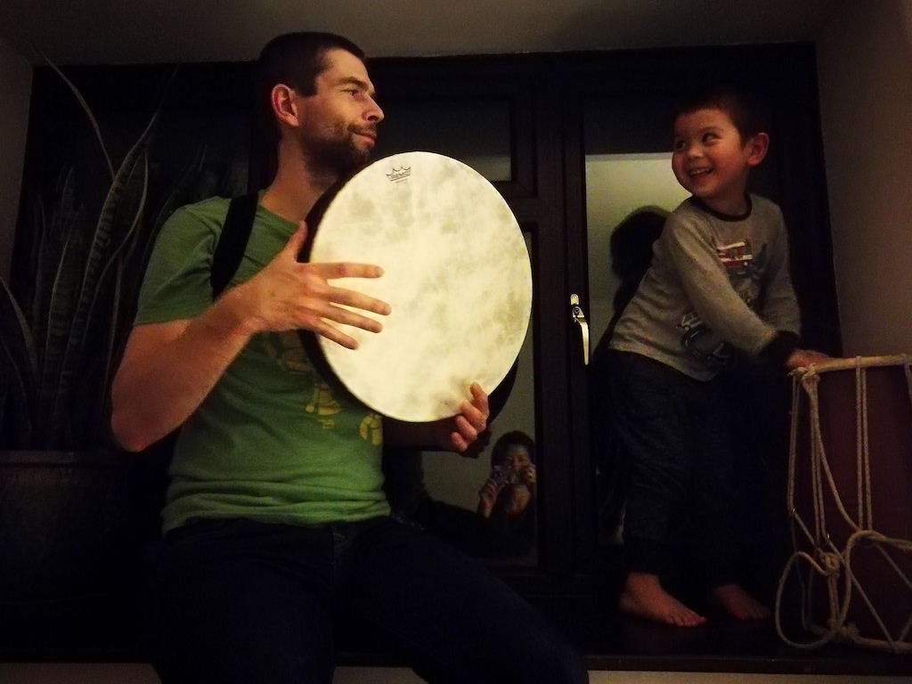

<!--
add frame drumming photo
add Vroju?
-->

 
These projects use the [OpenBCI-SuperCollider Interface](/ibva-supercollider-interface/) to read EEG data while listening to

1. [MONOLIT](https://nimetu.bandcamp.com/album/monolit) by [<kbd>Andrej Hrvatin</kbd>](https://nimetu.org/)
2. binaural beats designed by Robert Monroe including [The Gateway Experience](https://www.thegatewayexperience.com/wave-i-discovery-3-cd-set/) and
3. my own (live or prerecorded) frame drumming while shamanic journeying (meditating).

After recording sessions, subconscious 'visions' are interpreted in drawings. EEG data is currently analysed in SuperCollider only, but is planned to be analysed in Matlab as well.

To clarify, in contrast to several other projects in this research, the above projects do not use neurofeedback, they only record EEG activity affected by music for later (offline) analysis.

  

<iframe src="https://www.youtube.com/embed/wZZHXtzuJ9c?rel=0&amp;showinfo=0" style="border: 0; top: 0; left: 0; width: 100%; height: 100%; position: absolute;" allowfullscreen scrolling="no"></iframe>

  

