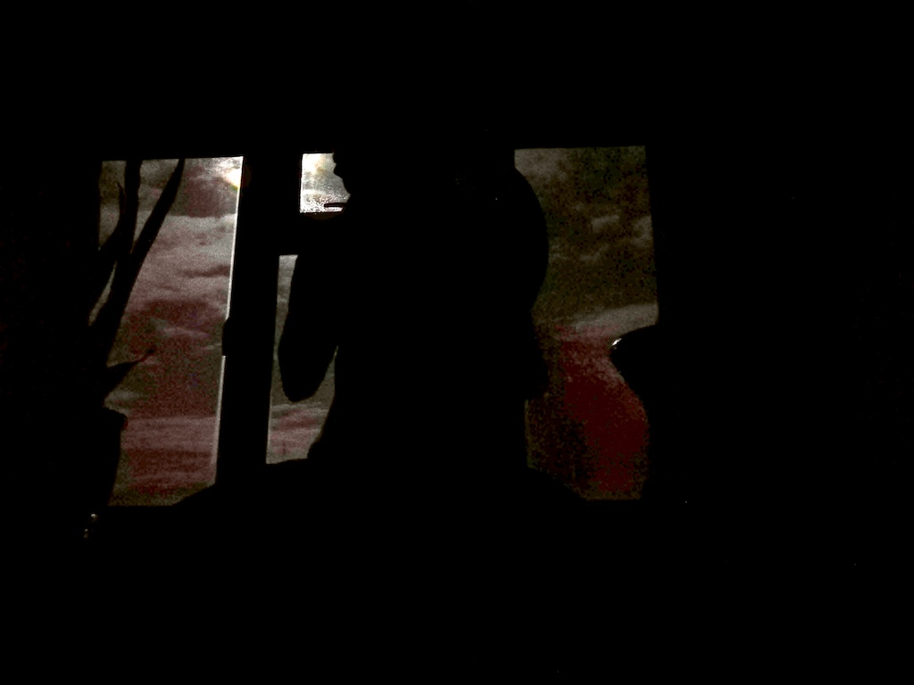

<!--
change category once not ongoing
TODO: add forest drawing;
TODO: add better drum in window picture;
-->

### frame drumming and storytelling

The Blue Forest is an imaginary forest my 4-year old son and I have been dreaming up while drumming before bedtime. We have characters e.g. colourful foxes who open the forest gates and the blue rabbit, whose house moves to different locations within the forest every time we visit. Between Jan 2019 and today we have recorded dozens of audio capturing our voices and the monotone drumming. We also have been drawing the characters and maps of the forest in a physical notebook.

