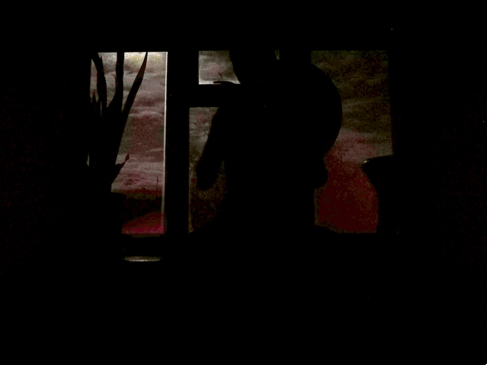

<!--
TODO: add forest drawing;
TODO: add better drum in window picture;
-->

### frame drumming and story telling

The Blue Forest is an imaginary forest my 4-year old son and I have been creating while drumming before bedtime.

