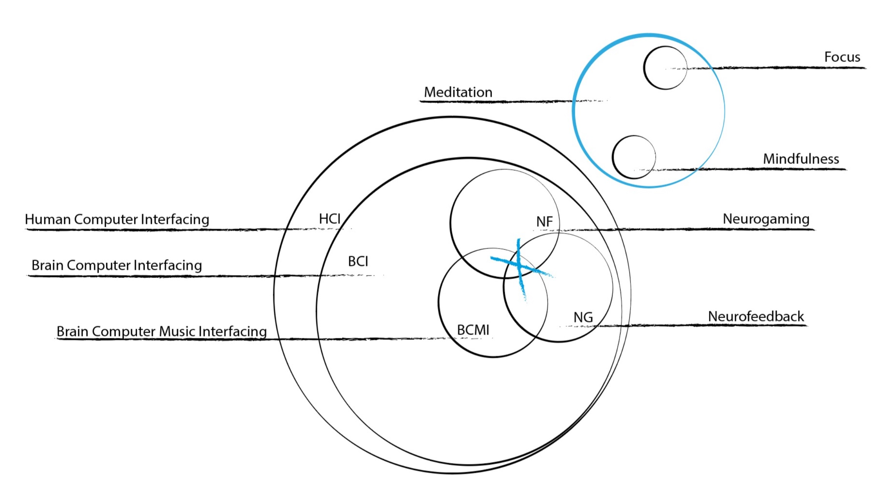
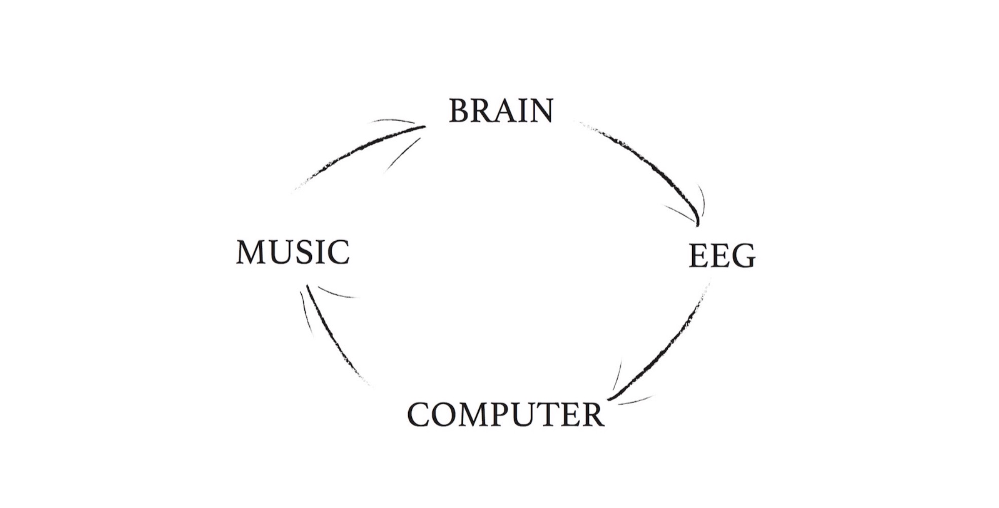
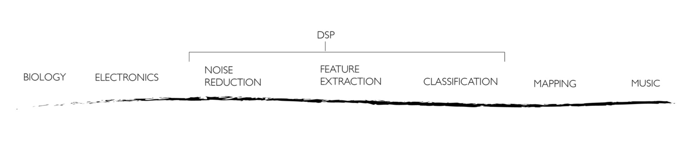
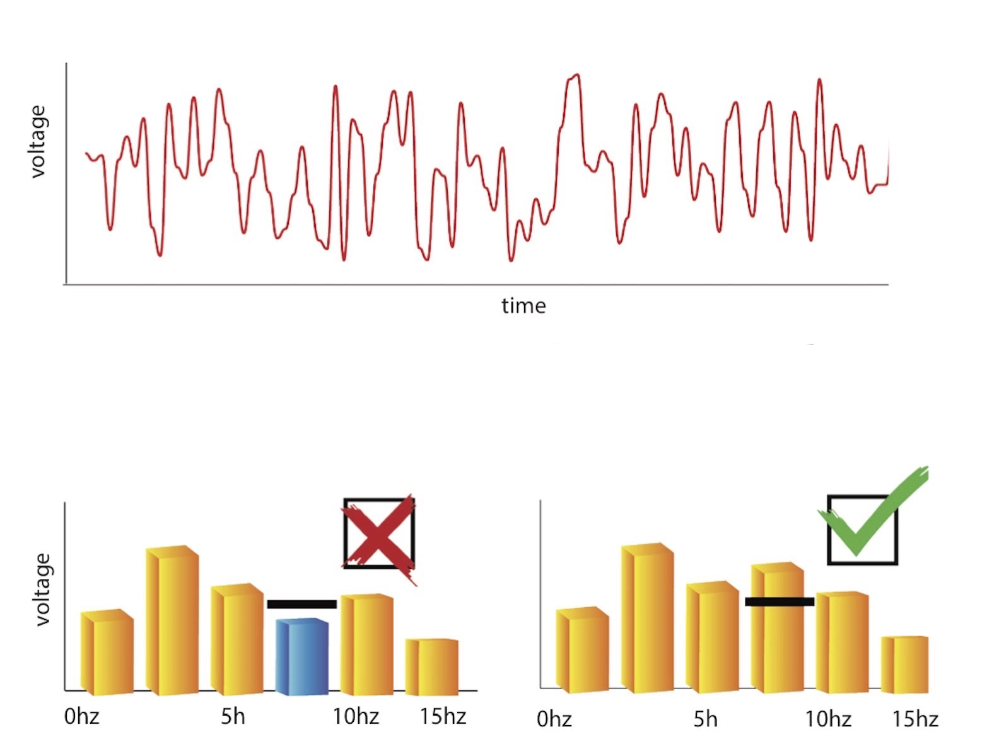
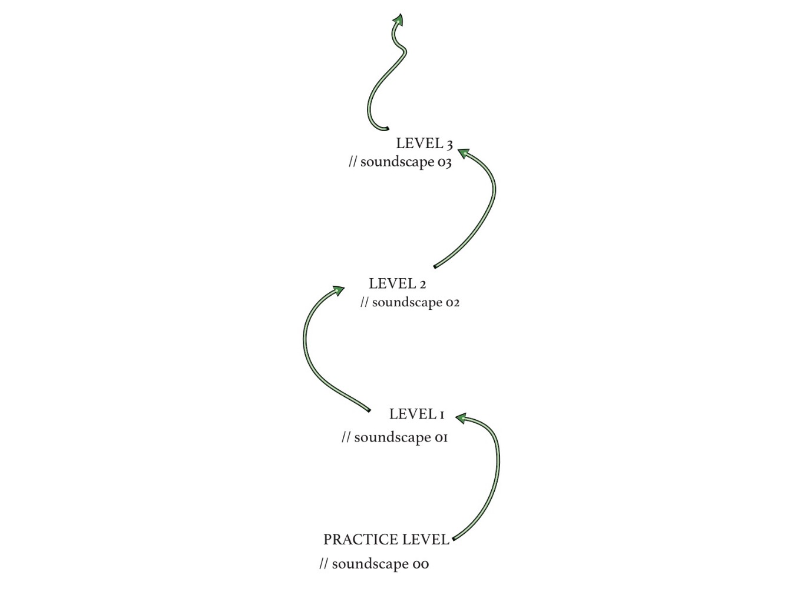
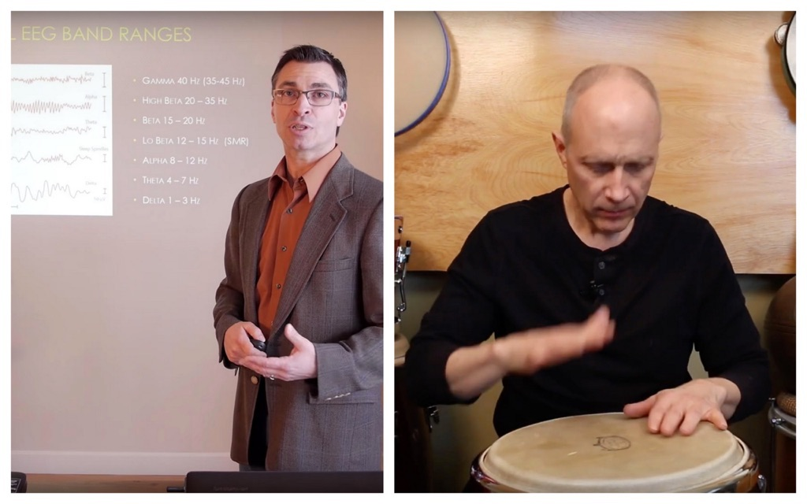
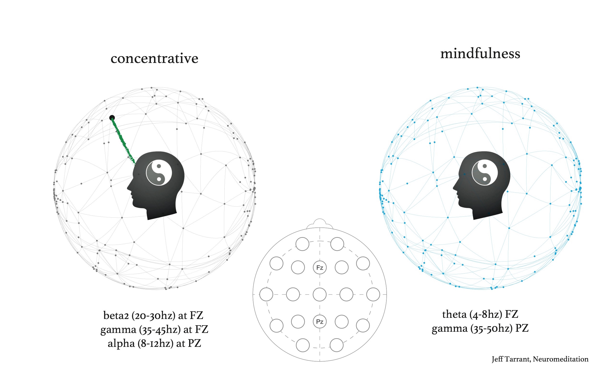
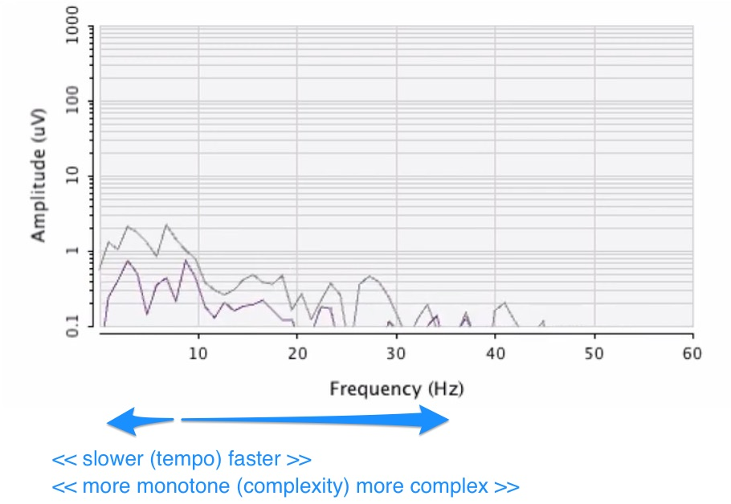

## Demonstration of Brain-Computer Music Interfacing Soundscape - Generative Rhythmic Entrainment
30 minute long

@ 2019 AES (Audio Engineering Society) International Conference on Immersive and Interactive Audio, York, UK ([<kbd>programme</kbd>](http://www.aes.org/conferences/2019/immersive/program.cfm))

### abstract

My interdisciplinary, practice research develops a Brain-Computer Music Interface (BCMI) which reinforces brainwave patterns linked to meditative states of mind by giving auditory feedback. The software employs the therapeutic benefits of neurofeedback, gaming, music and meditation in order to be effective in helping users understand consciousness. The software’s effectiveness is investigated in training programmes and demonstrated in presentations and concerts with consumer-graded electroencephalography.

_today:_
- brief outline of disciplines;
- main inspiration;
- demo with live EEG;

  

## orientation / interdisciplinary

// reinforces brainwave patterns ... by giving auditory feedback (neuro feedback)

  

## BCMI (information flow)

  

  

  

## gaming / soundscapes

// this will change: user can choose between soundscapes, each soundscape explores a specific type of meditation with a selected musical functions;
  

## prototypes 1 & 2

- 1: IBVA and Max/MSP

- 2: Neurosky and Supercollider ([trailer](https://khofstadter.info/focus-prototype/), [music](https://khofstadter.info/focus-trial/), [sequencer](https://bcmi.khofstadter.info/standalone-with-platypus/))

  

## prototype 3

- two Jeff's

  - Jeff Tarrant (left) and Jeff Strong (right)

  

## meditation (Tarrant)

> Meditation is a systematic mental training designed to challenge habits of attending, thinking, feeling, and perceiving. ~Jeff Tarrant

- [types of NeuroMeditation explained in youtube video](https://youtu.be/jU78oVzr-Ks?t=243) //play to 5:05

  

## rhytmic entrainment (Strong)

- [Auditory Brain Stimulation for Focus youtube video](https://youtu.be/-Os-TBHg5DQ?t=128) // play to 3:15;

  

## demo in SuperCollider

- thanks to [Fredrik Olofsson](https://www.fredrikolofsson.com/);
- most code open source on [GitHub](https://github.com/krisztian-hofstadter-tedor)
