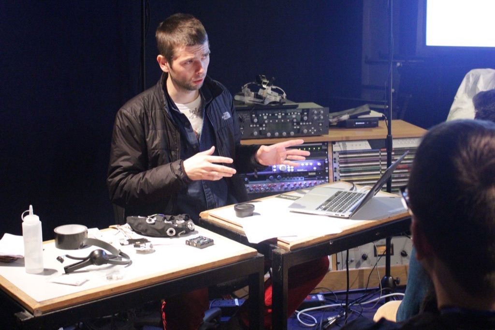
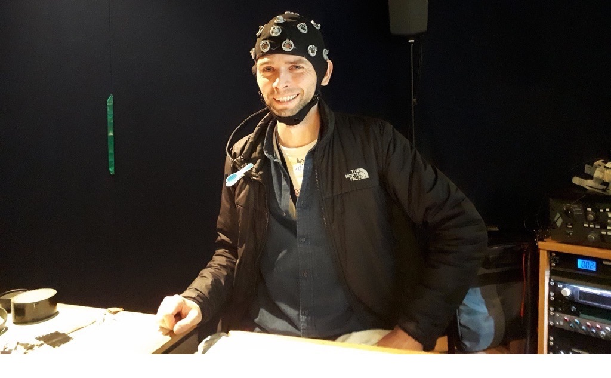

Demonstration of Brain-Computer Music Interfacing Soundscape - Generative Rhythmic Entrainment

@ 2019 Audio Engineering Society International Conference on Immersive and Interactive Audio, York, UK ([<kbd>programme</kbd>](http://www.aes.org/conferences/2019/immersive/program.cfm))

  

## Outline

- brief outline of disciplines;
- main inspiration;
- demo with live EEG in OpenBCI and SuperCollider;

  

picture by [Mariana Lopez](https://marianajlopez.com/)
