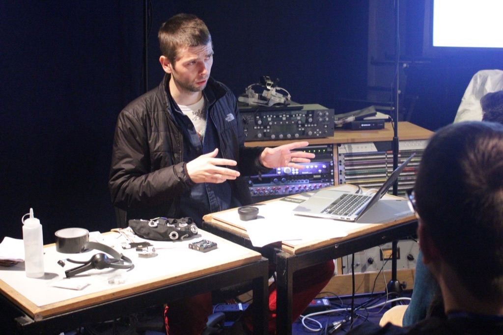
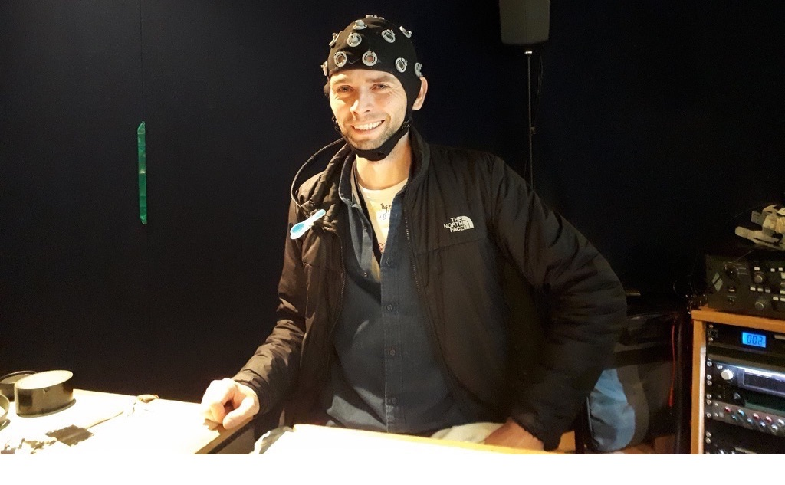

###  Demonstration of Brain-Computer Music Interfacing Soundscape - Generative Rhythmic Entrainment

@ 2019 Audio Engineering Society International Conference on Immersive and Interactive Audio, York, UK

Conference programme [here](http://www.aes.org/conferences/2019/immersive/program.cfm).

 

 

## presentation outline

- brief outline of disciplines

- main inspiration

- demo with live EEG in OpenBCI and SuperCollider

 

picture by [Mariana Lopez](https://marianajlopez.com/)
