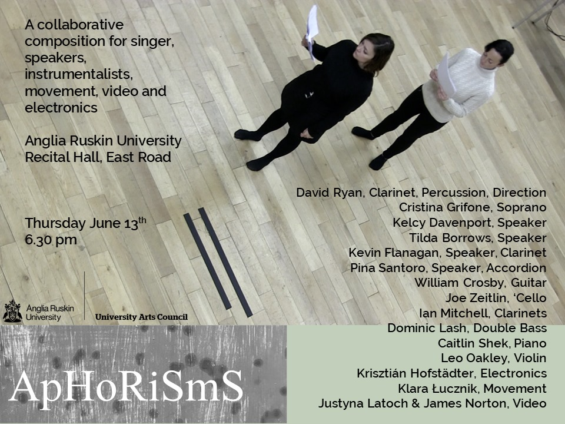
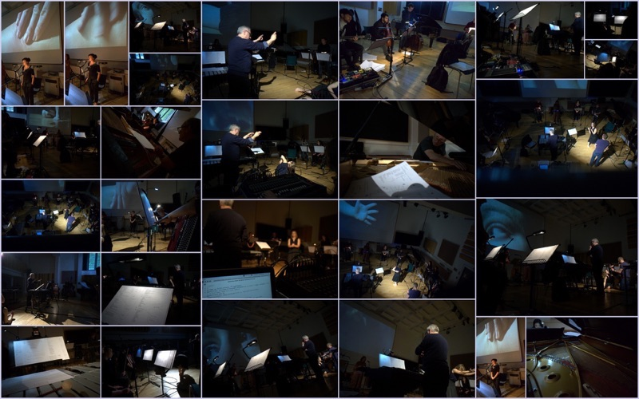

 
I have been working on connecting the BCMI idea in the research to a piece by David Ryan called Aphorisms. The initial idea was to compose a generative composition for the last part of Aphorisms, part 3, the Exodus. This composition supposed to have used live EEG to control certain arguments in SuperCollider synthesizers e.g. quad panning and frequencies in a drone sound texture sounding similar to a tibetan singing bowl. However, due to some unforeseen complications, we have postponed the idea with live EEG for later and focused my part on quad spatialisation and live processing of six live microphone inputs in SuperCollider.
 

 

Performance Mixdown (Part 3) by David: 

<iframe width="100%" height="166" scrolling="no" frameborder="no" allow="autoplay" src="https://w.soundcloud.com/player/?url=https%3A//api.soundcloud.com/tracks/638145756&color=%23161611&auto_play=false&hide_related=false&show_comments=true&show_user=true&show_reposts=false&show_teaser=true"></iframe>
