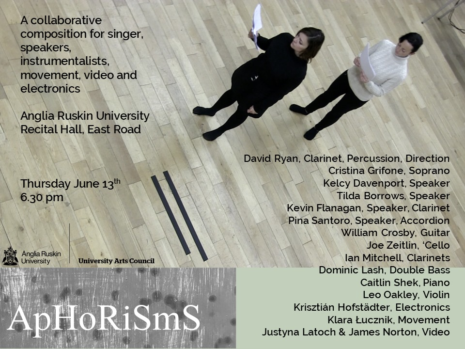
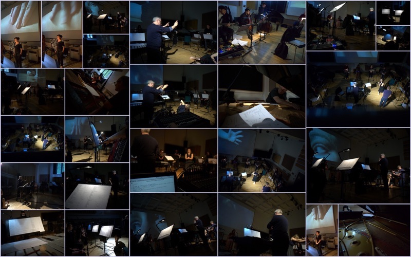

My part in this performance was to create abstract textures by using six dynamic microphones and signal processing in SuperCollider. Spatialisation used quad speaker setup. 
 
 
 

 
 
 

<iframe src="https://www.youtube.com/embed/pyPkSN6rsUk?rel=0&amp;showinfo=0" style="border: 0; top: 0; left: 0; width: 100%; height: 100%; position: absolute;" allowfullscreen scrolling="no"></iframe>

 
 

