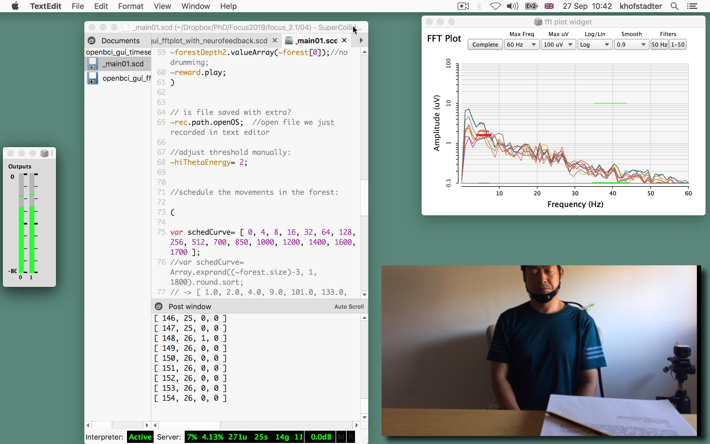
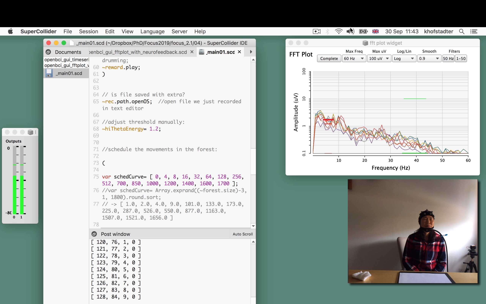
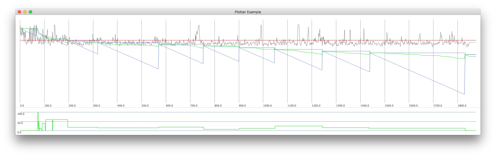

<!--
add https://www.maxlaumeister.com/pagecrypt/
-->
 
Neurofeedback sessions with 3 participants using the [OpenBCI-SuperCollider Interface](/openbci-supercollider-interface/) linked to the [Shamanic Meditation Soundscape](/shamanic-meditation-soundscape/). The goal was to help enhance the power of theta waves at Fz with a specific audio entrainment called rhythmic entrainment. The use of rhythmic entrainment in this project was inspired by the work of [Jeff Strong](https://www.stronginstitute.com/).
 
 
### Room
 

<iframe src="https://www.youtube.com/embed/8W7U3mrnR_s?rel=0&amp;showinfo=0" style="border: 0; top: 0; left: 0; width: 100%; height: 100%; position: absolute;" allowfullscreen scrolling="no"></iframe>

 
 
 
### Subject B and M
 

 
 

 
 
 
### Example of EEG analysis in SuperCollider
 

 
 
