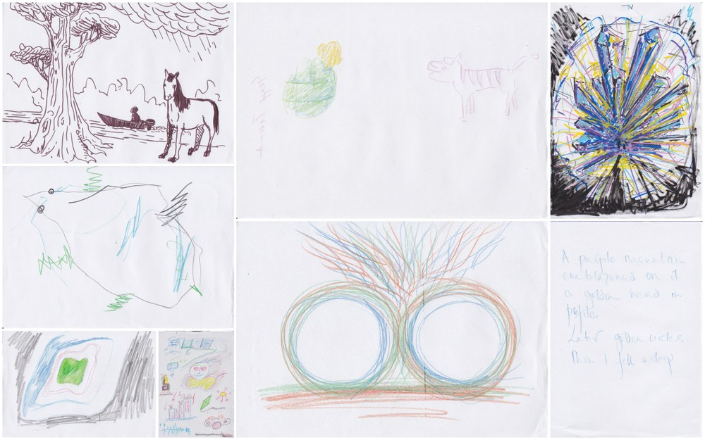

<!--
- edit/upload presentation video;
-->
@ [Cambridge Festival of Ideas](https://www.festivalofideas.cam.ac.uk/) 2019
 
 

 
 
### talk

- orientation. What is the interdisciplinary nature of the research?

- why shamanic methods to explore in first BCMI soundscape?

- why are neuromeditation sessions 30-minute long?

- what is different between the 30 min tests and this 20 min performance?

- why are the gaming elements absent in this performance?

- how shall you listen to the soundscape? Shall you listen to the digital shamans (drums and chakapa), my live drumming or the other sounds?

- shall you watch the screen or not?

- how much would you like me to explain before the performance about the mapping between EEG and sounds? If I explain everything, would that affect the way you listen? (Perhaps it won't help you to let go.)

- to deepen the meditation, I think you should focus your listening on the static/monotone elements of the soundscape, the digital shaman drumming (speakers).

- eyes closed is preferred, but you can keep it open if you'd like.

- no intent - no journey :)

- would be great if you can draw your 'visions' after the performance.
 
 
 
### Performance
(in video collage)

<iframe src="https://www.youtube.com/embed/lFVzwZtmecc?rel=0&amp;showinfo=0" style="border: 0; top: 0; left: 0; width: 100%; height: 100%; position: absolute;" allowfullscreen scrolling="no"></iframe>

The performance used the [OpenBCI-SuperCollider Interface](/openbci-supercollider-interface/) with the [Shamanic Meditation Soundscape](http://localhost:4000/shamanic-meditation-soundscape/) software. Audio release featuring the stereo and surround files can be access through [shamanic soundscape - level two](/shamanic-soundscape-level-two/).
 
 
 
### Plotting my EEG data
(in SuperCollider)

 
 
Plot meanings:
- row 1: theta median FZ (grey) with threshold on 1.5 microVolts (black)

- row 2: levels (blue triangles), theta median above threshold (green going down)

- row 3: theta median above threshold in % (green steps)

- row 4: theta median on P3 and P4 and their coherence below (green)

- row 5: theta median on F4 and P4 and their coherence below (green)
 
 
 
### Drawings
Some visual interpretations of the journeys from the group:
 
 

 
 
 
