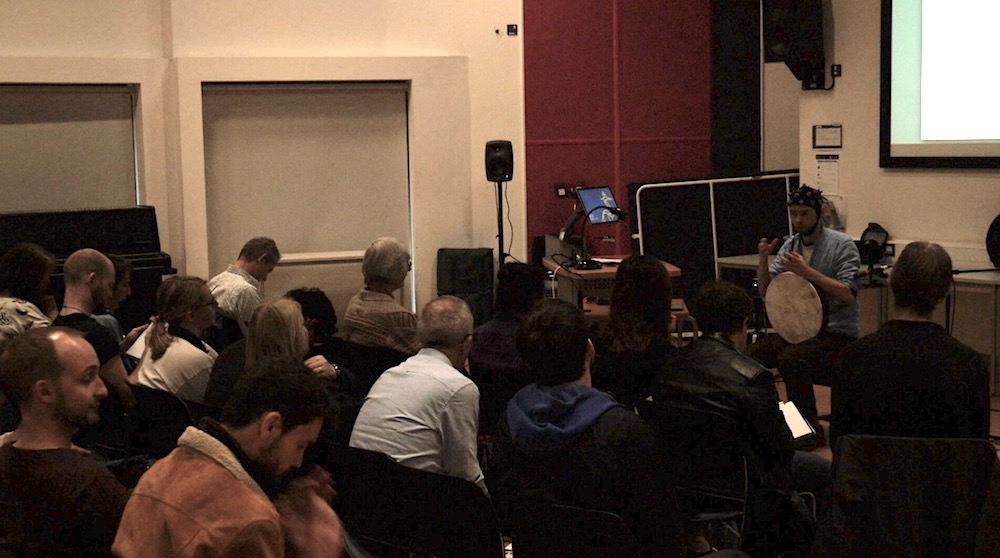
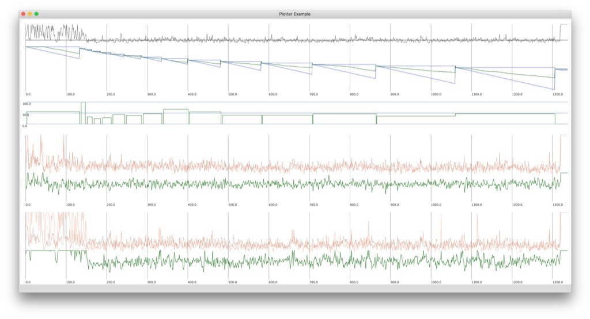

Title: NeuroMeditation with Music

Presentation, performance and drawing, Q/A

@ 2019, Cambridge Festival of Ideas

  

### Presentation
- orientation

- shamanic methods to explore for first BCMI soundscape

- explanation of 30-minute tests

- what is different between the 30 min tests and this 20 min performance?

- why are the gaming elements absent in this performance?

- how shall you listen to the soundscape? Shall you listen to the digital shamans (drums and chakapa) or my live drumming or the other sounds?

- shall you watch the screen or not?

- how much would you like me to explain before the performance about the mapping between EEG and sounds? If I explain everything, would that affect the way you listen? Perhaps it won't help you to let go.

- to deepen the meditation, I think you should focus you listening on the static/monotone elements of the soundscape, the digital shaman drumming (speakers).

- eyes closed is preferred

- no intent - no journey :)

- would be great if you can draw your 'visions' after the performance

Presentation video is being edited.

 
 

### Performance

<iframe src="https://www.youtube.com/embed/lFVzwZtmecc?rel=0&amp;showinfo=0" style="border: 0; top: 0; left: 0; width: 100%; height: 100%; position: absolute;" allowfullscreen scrolling="no"></iframe>

 
 

### Plotting my EEG data

 
 

row 1: theta median FZ (grey) with threshold on 1.5 microVolts (black)

row 2: levels (blue triangles), theta median above threshold (green going down)

row 3: theta median above threshold in % (green steps)

row 4: theta median on P3 and P4 and their coherence below (green)

row 5: theta median on F4 and P4 and their coherence below (green)

these parameters controlled certain aspects of the music in real time

 
 

### Drawing and Q/A:

Some interpretations of the journey:

  
