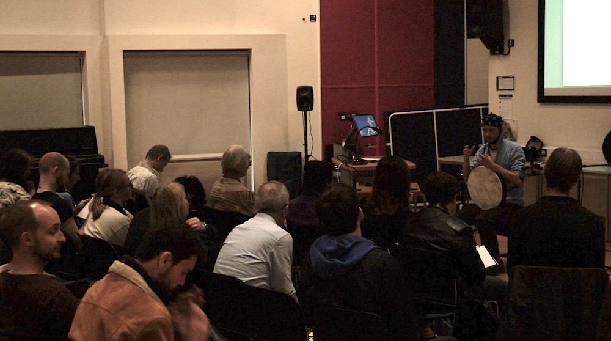
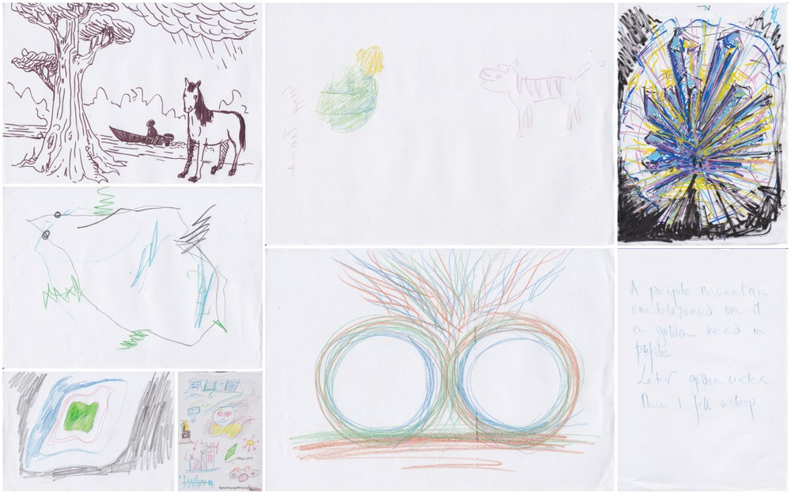

Title: NeuroMeditation with Music

Presentation, performance and drawing, Q/A

@ 2019, Cambridge Festival of Ideas

  

### Presentation
- orientation

- the first choice for soundscape style was shamanic drumming

- explanation of 30-minute tests

- what is different between the tests and this performance?

- why are the gaming elements absent in this performance?

- why is the performance shorter (20 min) than the tests?

- how shall you listen to the soundscape? Shall you listen to the digital shamans (drums and chakapa) or my live drumming or the other sounds?

- shall you watch the screen or not?

- how much would you like me to explain before the performance about the mapping between EEG and sounds? If I explain everything, would that affect the way you listen? Perhaps it won't help you to let go.

- to deepen the meditation, I think you should focus you listening on the static/monotone elements of the soundscape, the digital shaman drumming (speakers).

- eyes closed is prefered

- no intent - no journey :)

- would be great if you can draw your 'visions' after the performance

 
 

### Performance

// audio and video archive asap

 
 

### Drawing and Q/A:

Some interpretations of the journey:

  
