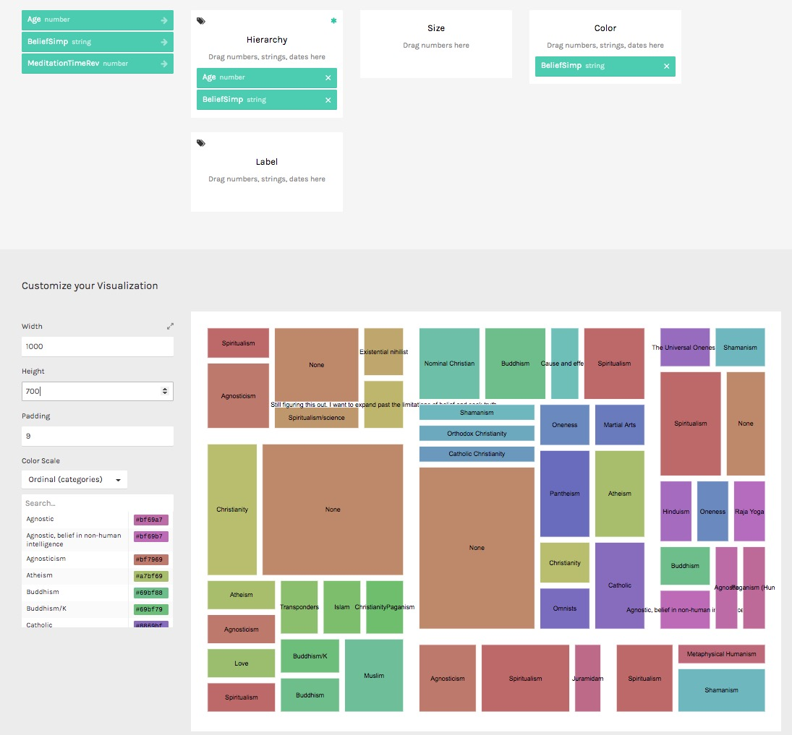

 
All data in .csv formats will uploaded anonymously to GitHub.
  
A short overview of the analysis will be presented as part of the PhD commentary, in _project_c_. More detailed analysis will be presented later in a separate publication.
  

  
The data from the shamanic meditation survey (n=83) is currently being analysed with [RAWGraphs](https://rawgraphs.io/).
   
Previews:

  

  

