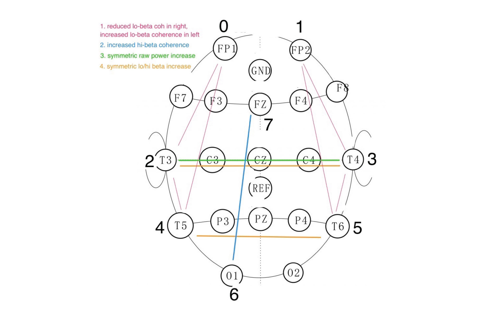

<!--
- can i find the corine protocol image with 'cancelled' on it - it is in the Facebook downloaded archive.
- image for berlin - colchester BCMI?
-->

 
BCMI-2 (the second system developed in the research) is used with neurofeedback protocols in the following projects:

1. corine protocol
2. here and now (revisited)
3. berlin - colchester BCMI

### 1. corine protocol
In this project I have been designing a neurofeedback protocol to be used with BCMI-2 between its main two parts, the [Open-SuperCollider-Interface](/openbci-supercollider-interface/) (Interface) and the [Shamanic Soundscape Generator](/shamanic-soundscape-generator/) (Generator). The protocol is based on Flor-Henry et all.'s paper titled '[Brain changes during a shamanic trance: Altered modes of consciousness, hemispheric laterality, and systemic psychobiology](https://www.researchgate.net/publication/315988926_Brain_changes_during_a_shamanic_trance_Altered_modes_of_consciousness_hemispheric_laterality_and_systemic_psychobiology)', where a shamanic practitioner's, [Sorine Sombrum](https://www.corinesombrun.com/en/biography/)'s EEG was analysed with qEEG and LORETA methods while she was entering a Shamanic State of Consciousness (SSC). Due to the difference between the amount of channels used in their research (43) and the amount of channels currently available in the Interface (8), the neuromarkers for my _corine (neurofeedback) protocol_ needed certain simplification. (This simplification was also needed as the Interface does not support LORETA analysis yet.)

The prototype of this protocol should have been tested at the [2020 Cambridge Science Festival](https://issuu.com/camscifest/docs/csf_2020_online), however due to the pandemic the event was cancelled and now the demonstration needs to be rescheduled.

 
 

### 2. here and now (revisited)
As a member of [David Ryan](http://david-ryan.co.uk/)'s [Opera Aperta Project](https://operaapertaproject.com/), I have been designing an alternative version of '[Here and Now](https://operaapertaproject.com/works/)' (2020) in which I develop sound textures to be used as control parameters in a BCMI soundscape. The sound textures are based on recordings prepared for the original piece e.g. bass clarinet, percussion, Tibetan bowls, cello, piano, voices. In regard to form, the soundscape generator for 'here and now (revisited)' is similar to the Shamanic Soundscape Generator. It has two main groups of audio tracks. One that is more controlled (e.g. overall duration is set) and one in which a variety of sound textures interact with real-time EEG via a neurofeedback protocol. The goal of the experiment is to demonstrate the use of BCMI for audiences primarily interested in contemporary classical music and to continue developing the surround spatialisation method developed for a previous Opera Aperta Project project, [aphorisms](/aphorisms/).

 

photo at aphorisms event (2019-06-13) by Abi Pateman.

 
 

### 3. berlin - colchester BCMI
This project experiments with sending BCMI data via the internet using [Tunnelblick](https://tunnelblick.net/) between two countries. The method developed by Fredrik is primarily tested to understand how the Interface could be used for real-time BCMI performances online.
