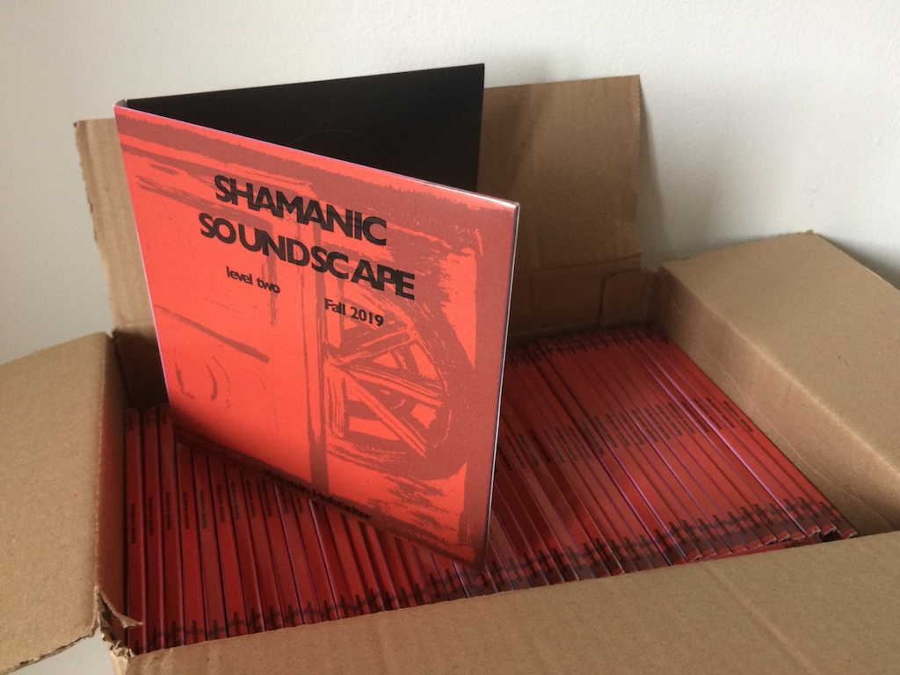

> Some shamanic practitioners journey to nonordinary realities with fast and repetitive drumming. As an experiment, the soundscapes on this release extend on these traditional forms. They feature more diverse rhythms, tempo changes, added sound textures and surround sound. The software that generates these soundscapes uses real-time brainwave data with neurofeedback protocols. The protocols control characteristics of prerecorded and live sounds.

This release contains audio recordings from the [2019 Cambridge Festival of Ideas](/festival-of-ideas-2019-talk-performance/). More info and surround files can be found on the [Bandcamp page](https://tedor.bandcamp.com/album/shamanic-soundscape-level-two).
  

<iframe style="border: 0; width: 350px; height: 555px;" src="https://bandcamp.com/EmbeddedPlayer/album=813941516/size=large/bgcol=ffffff/linkcol=0687f5/transparent=true/" seamless><a href="https://tedor.bandcamp.com/album/shamanic-soundscape-level-two">shamanic soundscape - level two by Krisztián | tEdör | Hofstädter</a></iframe>

 
The binaural beats version of 'jester' was added in June 2020, after [listening test 2](/listening-test-survey-2/).
  

