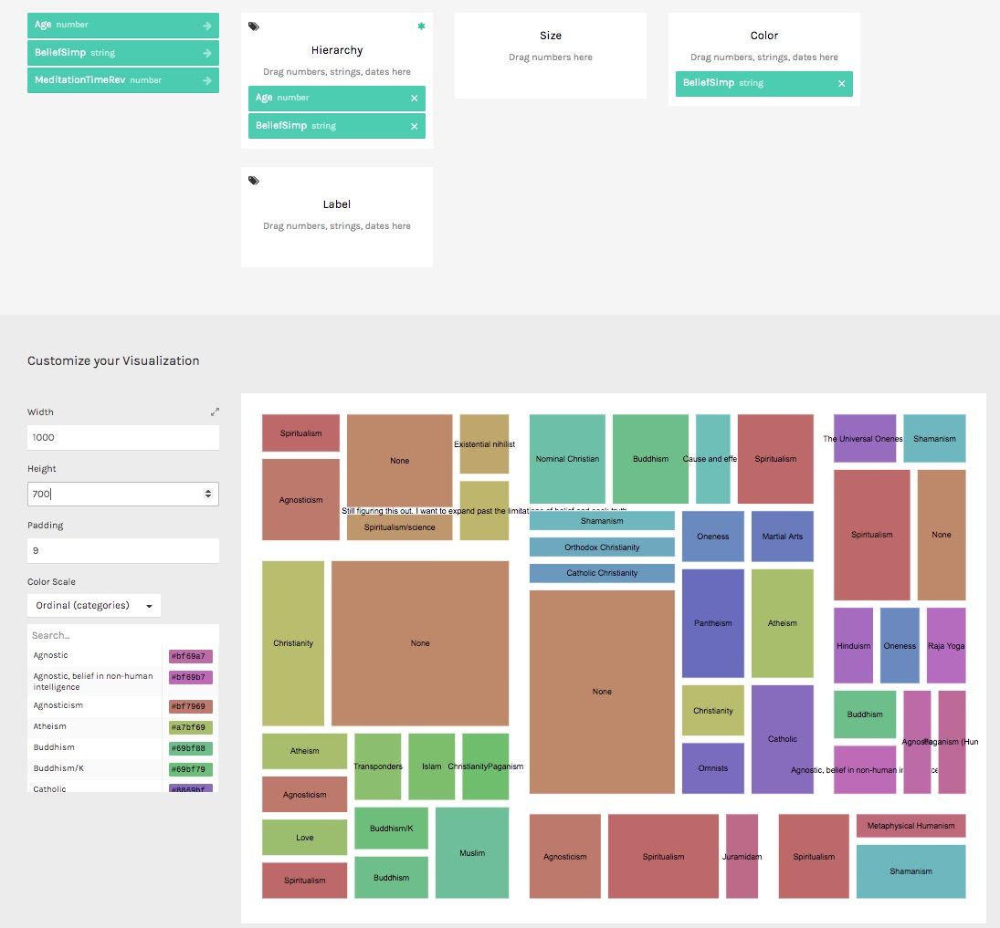
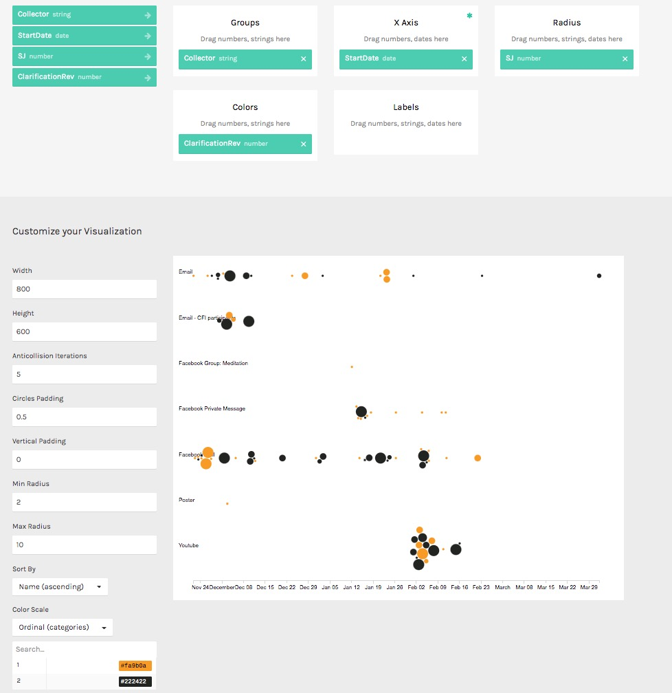
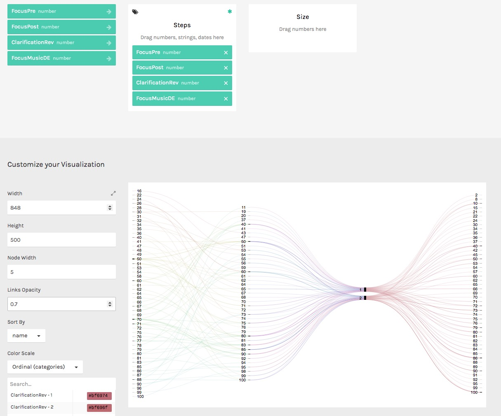

This project analyses data from the two online listening studies ([1](/listening-study-2/), [2](/listening-study-1/)) and uses [RAWGraphs](https://rawgraphs.io/) to produce aesthetic and meaningful visual representations of the data. 

A preliminary analysis of the first listening study is written up as a chapter in the submitted PhD commentary. The completed analysis is planned to be published as an academic paper.

Some screenshots of RAWGraphs in use:

  

  

